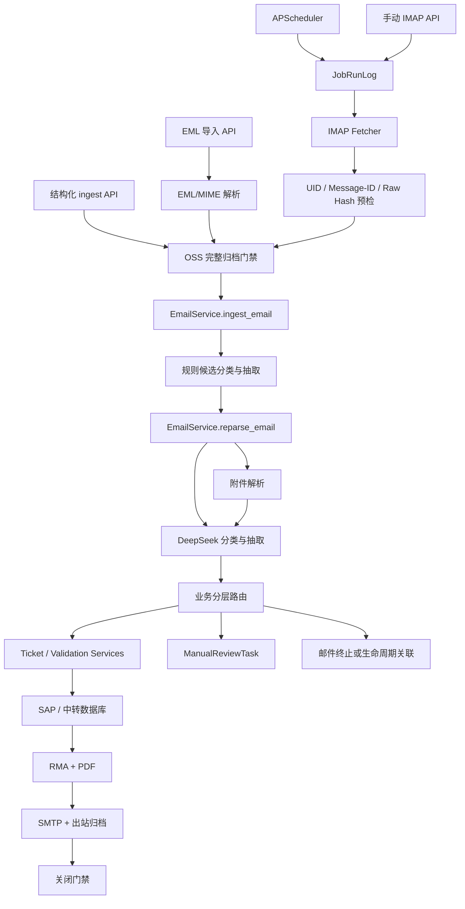
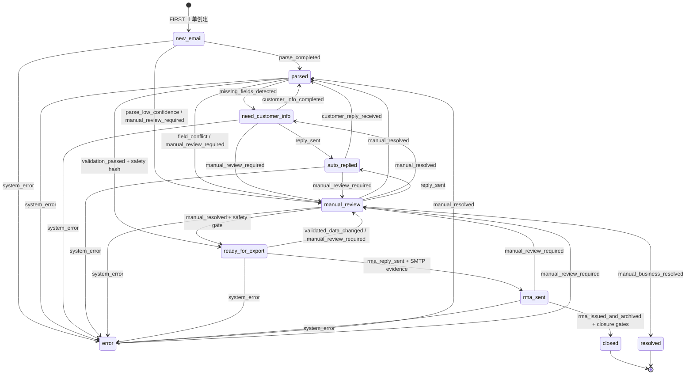

# 当前代码业务流程与状态体系分析

> 审计基线：提交 `34625bf`（分支 `codex-dev`）  
> 审计日期：2026-08-12  
> 事实优先级：运行代码、ORM/Alembic、API、测试、前端，文档仅作辅助。  
> 基线验证：`python -m pytest -q`，结果为 `383 passed, 2 skipped`。

## 1. 结论摘要

当前系统不是单一线性“邮件转工单”程序，而是由 APScheduler、数据库后台任务队列和多个 Service 共同驱动的事件型系统。主编排分散在：

- `app/main.py`：IMAP、后台任务、日志维护和一致性修复调度；
- `app/services/jobs.py`：任务分发、重试和失败归类；
- `app/services/imap_fetcher.py`：IMAP 获取、逐封归档及持久化；
- `app/services/emails.py`：入库、附件解析、AI 分类抽取和业务路由；
- `app/services/tickets.py`、`ticket_safety.py`：工单字段采纳、SN/完整性校验；
- `app/services/workflow.py`：工单主状态合法转换和人工任务创建；
- `app/services/manual_review.py`：人工任务动作；
- `app/services/sap_rma.py`、`replies.py`：SAP/RMA、PDF、SMTP 和出站归档闭环。

顶层可归纳为 8 条主要业务分支：

1. 无关/非业务邮件；
2. FIRST 自动报修（新报修、线程中新报修、客户补充）；
3. SECOND 人工业务；
4. 生命周期通知；
5. 未知/低置信度/冲突；
6. 缺少可靠父邮件的孤立回复；
7. 已关闭工单后续邮件；
8. 解析、校验或外部系统异常。

工单主状态共 10 个，但不存在单一的“子状态”字段。邮件、附件、解析结果、人工任务、回复、SN、政策、返修路由、SAP、RMA、PDF/归档、后台任务及外部操作各自维护状态。当前主要问题正是这些状态与主业务状态、执行阶段在多个 Service 中交叉更新。

## 2. 当前架构与真实入口



### 2.1 自动 IMAP 入口

实际调用链：

```text
app.main.lifespan
→ _scheduled_imap_fetch
→ jobs.enqueue_job(job_type="imap_fetch")
→ _scheduled_job_worker
→ jobs.claim_next_job
→ jobs.execute_claimed_job
→ jobs._execute_job_command
→ imap_fetcher.run_imap_fetch_locked
→ imap_fetcher.fetch_imap_emails
→ mail_precheck.precheck_imap_uid / precheck_email_payload
→ eml.payload_from_eml_bytes / attachment_blobs_from_eml_bytes
→ OSS 原文与附件归档
→ emails.ingest_email
→ emails.reparse_email（auto_parse=true）
```

关键事实：

- 调度条件同时要求 `IMAP_FETCH_ENABLED=true` 和 `IMAP_ARCHIVE_TO_OSS=true`；否则 scheduler 不启用。
- IMAP 使用只读选择，系统有意不依赖“已读”标记表示完成。
- 同一进程通过 `imap_fetch_lock()` 防止并发抓取；任务队列通过 `with_for_update(skip_locked=True)` 领取。
- 先过滤已处理或尚未到重试时间的 UID，再应用批量 limit，避免旧 UID 饥饿。
- 每封邮件独立归档、入库和提交；单封失败不会回滚整批。

### 2.2 手动导入入口

API 入口位于 `app/api/v1/emails.py`：

- `POST /emails/ingest`：结构化 payload；正式使用仍要求原始 EML 和附件已经有 OSS object ID。
- `POST /emails/ingest/jobs`：先入库，后 enqueue `email_parse`。
- `POST /emails/ingest-eml`：解析上传 EML、过滤装饰图片、归档后入库。
- `POST /emails/ingest-eml/jobs`：同上，但解析异步执行。
- `POST /emails/fetch/jobs`：手动触发 IMAP 后台任务。
- `POST /emails/{id}/reparse[/jobs]`：人工重解析入口。

手工 EML 的核心 MIME 实现位于 `app/services/eml.py`。它读取 From/To/Cc/Delivered-To/X-Original-To、Subject、Date、Message-ID、In-Reply-To、References，分别聚合 plain/html 正文，并把普通附件与带 Content-ID 的非文本 inline part 都作为附件。

## 3. 邮件进入系统的详细行为

### 3.1 去重与入库时机

去重分两层：

1. IMAP 预检：邮箱账号、folder、UIDVALIDITY、UID 对应 `mail_fetch_records`，跳过已成功或未到重试时间的记录。
2. 邮件事实去重：`Email.message_id` 或 `source_content_sha256` 已存在则返回 duplicate。

Message-ID 缺失时由 `normalize_message_id(..., fallback_hash=raw_eml_sha256)` 生成稳定替代值。正式 `Email` 记录只在以下条件满足后创建：

- 原始 EML 已上传 OSS；
- 每个保留附件都已上传 OSS；
- 归档引用完整。

因此当前正式 IMAP 路径采用“先归档，后业务入库”。仓库注释指出手工 EML 的 OSS 降级曾是缺陷，不应被视作正式业务规则。

### 3.2 线程识别

`emails._find_thread_for_email` 的实际优先级：

1. 从 `References` 中逆序查找已存在邮件；
2. 精确匹配 `In-Reply-To`；
3. 未匹配则创建新线程。

当前不按标准化主题、发件域或时间窗口自动模糊合并。`normalized_subject` 和 `from_domain` 虽传入函数，但未用于回退关联。这样避免误合并，却会让缺失 RFC Header 的真实回复成为孤立线程。系统另提供人工 merge/split API。

### 3.3 Reply / Forward 与正文处理

- Reply 的确定性依据是 `In-Reply-To` 或 `References`，随后结合 AI/规则语义区分客户补充、线程中新报修或线程其他问题。
- Forward 主要靠主题/正文中的 `fwd:`、`fw:`、转发字样判为 `unknown`，默认进入人工而非自动关联。
- HTML 通过 BeautifulSoup/lxml 转文本；plain text 优先。
- `normalize_email_body` 统一换行；`extract_latest_reply_segment` 在原始邮件标记或签名标记处截断。
- 当前引用和签名剥离是启发式正则，不是 MIME/thread-aware 的完整引用解析器。

### 3.4 内嵌图片和附件

- EML 解析保留 Content-ID、inline 标志和哈希。
- 小于配置宽高阈值的 inline 图片在归档前过滤，或解析时标记 `skipped_decorative`。
- 同名附件允许存在，没有按文件名唯一约束；文件哈希会保存，但当前未做同邮件附件内容去重。
- 空文件没有统一的前置拒绝；不同解析器可能得到空文本或进入人工。

## 4. 分类、抽取与业务路由

### 4.1 两层分类

第一层是 `parser.analyze_email_rules`：

- 在正式业务入库前产生 rule candidate；
- 使用关键词、回复 Header 和简单正则分类；
- 同时抽取 SN、联系邮箱、故障描述；
- 结果写入 `parse_results`，`parser_type=rule`、`apply_status=candidate_only`。

第二层是 `ai.create_ai_parse_candidate`：

- DeepSeek 同时执行语义分类和结构化字段抽取；
- 输入包含邮件、规则候选、线程/活动工单上下文和附件解析聚合结果；
- 输出 Pydantic `AiExtractResponse`；
- 再通过确定性代码标准化 intent、置信度、字段、明细和 evidence。

虽然已有 Pydantic 校验和 `response_format=json_object`，Provider 仍自行用 httpx 调厂商兼容接口并对文本执行 `json.loads`，尚未真正通过 LangChain structured output。

### 4.2 当前分类目录

| Handling Level | Intent | 当前路由 |
|---|---|---|
| `auto_repair` | `new_repair` | FIRST 自动报修 |
| `auto_repair` | `thread_new_repair` | 在线程中创建新报修语义；必要时解除关闭工单关联 |
| `auto_repair` | `customer_supplement` | 合并到活动工单并重新校验 |
| `manual_rma_business` | `component_replacement_repair` | SECOND 人工业务 |
| `manual_rma_business` | `onsite_service` | SECOND 人工业务 |
| `manual_rma_business` | `warranty_status_inquiry` | SECOND 人工业务 |
| `manual_rma_business` | `repair_thread_other` | SECOND 人工业务 |
| `lifecycle_only` | `device_intake_received` | 仅关联生命周期事件 |
| `lifecycle_only` | `repaired_device_dispatched` | 仅关联生命周期事件 |
| `lifecycle_only` | `customer_repaired_device_received` | 仅关联生命周期事件 |
| `lifecycle_only` | `contract_confirmation` | 仅关联生命周期事件 |
| `lifecycle_only` | `invoice` | 仅关联生命周期事件 |
| `lifecycle_only` | `third_party_equipment_quote` | 仅关联生命周期事件 |
| `unknown` | `unknown` | 邮件级人工任务 |
| 无 handling level | `irrelevant` | 跳过，记录终止原因 |

旧值 `customer_reply`、`internal_forward`、`normal_reply`、`device_received` 在核心分类模块中映射到新枚举；部分兼容分支仍引用旧值，是状态/分类历史债务。

### 4.3 不确定分类和人工兜底

以下情况进入人工：

- intent 为空或 `unknown`；
- confidence 低于 `AUTO_APPLY_MIN_CONFIDENCE`；
- 存在 conflict fields；
- 关键附件为 `needs_manual_review`、`unsupported` 或 `failed`；
- SECOND 业务；
- 孤立回复；
- 已关闭工单收到可能修改既有 RMA 的邮件；
- SN、安全校验、政策或返修路由不通过。

PRC 是特殊兼容：如果 PRC 解析失败但业务字段并不缺失，附件失败不一定阻断自动流程。

## 5. 附件解析体系

### 5.1 当前能力矩阵

| 格式 | 当前确定性处理 | AI/VL 使用 | 主要限制 |
|---|---|---|---|
| PDF | pypdf/PyMuPDF 提取文本、页数和渲染 | 无文本时逐页 Qwen-VL；有文本时 Qwen 文本理解 | 最多 15 页；未显式解析表格结构 |
| DOCX | ZIP 安全阈值后读取 `word/document.xml` 段落 | 提取文本交 Qwen | 未读取表格、页眉页脚和内嵌图片 |
| XLSX | openpyxl read-only；最多 10 sheet、每表 200 行、40 列 | 标准化文本交 Qwen | 结构被扁平为文本；不支持旧 `.xls` |
| CSV | csv reader，最多 200 行 | 文本交 Qwen | 未保留强类型表格 Schema |
| TXT | 编码探测和截断 | 未超限时 Qwen；超限本地 fallback | 超长文本只保留截断结果 |
| PRC | 仅按可打印文本尝试解析 | 文本交 Qwen | 二进制或私有格式无法解析 |
| HTML | BeautifulSoup 提取文本 | 文本交 Qwen | 结构和图片关系丢失 |
| 图片 | 尺寸判断 | Qwen-VL | 小 inline 图片跳过 |
| ZIP/RAR/7Z/TAR/GZ | 类型/魔数识别 | 不调用 AI | 作为工程参考直接跳过，不解压、不遍历 |
| Word `.doc` | 不支持 | 无 | 进入 unsupported/人工 |
| Excel `.xls` | 不支持 | 无 | 依赖中有 xlrd，但业务解析器未接入 |

### 5.2 压缩包真实状态

通用压缩包当前路径是：

```text
检测扩展名/MIME/魔数
→ 标准化 content-type
→ 标记 attachment_role=engineering_reference
→ parse_status=skipped
→ 不阻断工单
```

没有实现密码检测、恶意路径检查、隔离解压、多层深度、子文件分类、重复成员处理或聚合。需要特别区分：DOCX/XLSX 本身是 ZIP 容器，现有 `_validate_zip_archive` 已限制 1000 个成员、100MB 展开大小和 100 倍压缩比；这不等于通用压缩附件已经支持。

### 5.3 最大架构问题

`attachment_parser.py` 同时承担：文件类型判断、下载、确定性解析、Qwen client 创建、prompt、重试、AI 日志、fallback 和 ORM 状态更新。读取、解析、理解、业务抽取边界尚未彻底分离。普通文档的确定性内容也统一再送 Qwen，成本与职责边界不够清晰。

## 6. 当前工单状态机

### 6.1 主状态表

| 主状态 | 实际字段 | 进入条件 | 主要退出条件 | 更新代码 | 前端表现 | 可达性 |
|---|---|---|---|---|---|---|
| `new_email` | `repair_tickets.current_status_code` | 创建 FIRST 工单 | 解析完成、低置信度、人工或系统异常 | `tickets.py`、`workflow.py` | 已映射 | 可达 |
| `parsed` | 同上 | 采纳解析；客户补充完成；人工恢复 | 缺字段、校验通过、冲突/人工、异常 | `tickets.py` | 已映射 | 可达 |
| `need_customer_info` | 同上 | 必填字段缺失或人工判定追问 | 回复成功；客户已补齐；人工/异常 | `tickets.py`、`manual_review.py` | 已映射 | 可达 |
| `auto_replied` | 同上 | 追问邮件 SMTP 明确成功 | 客户回复重解析；人工/异常 | `replies.py`、`workflow.py` | 已映射 | 可达 |
| `manual_review` | 同上 | 低置信度、冲突、SN/政策/附件/外部异常等 | 人工到 parsed/need_customer_info/ready_for_export/resolved；异常 | `workflow.py`、`manual_review.py` | 已映射 | 可达 |
| `ready_for_export` | 同上 | 完整性、SN、安全门通过并带 safety hash | RMA 回复已发送；数据变化退人工；异常 | `ticket_safety.py`、`workflow.py` | 已映射 | 可达 |
| `rma_sent` | 同上 | 有 reply ID 和 SMTP Message-ID 证据 | 所有关闭门禁通过；人工/异常 | `replies.py`、`workflow.py` | 已映射 | 可达 |
| `error` | 同上 | 任一非终态触发 `system_error` | 人工修复回 parsed 或转人工 | `workflow.py` | 已映射 | 可达，但大量异常实际只更新子状态/任务，不一定进入此状态 |
| `closed` | 同上 | RMA、PDF、SMTP、Message-ID、PDF/出站归档全部有事实 | 无；关闭后线程活动 ticket 解绑 | `workflow.py` | 已映射 | 可达 |
| `resolved` | 同上 | SECOND 人工业务完成 | 无 | `workflow.py`、`manual_review.py` | **缺少映射** | 可达 |

### 6.2 当前真实状态机



### 6.3 并行子状态体系

| 领域 | 字段 | 已观察值/语义 |
|---|---|---|
| 邮件解析 | `emails.parse_status` | pending、parsing、parsed、skipped、needs_manual、failed |
| 邮件执行 | `emails.processing_stage` | fetched、classified、parsing、manual_review、completed 等 |
| 附件 | `email_attachments.parse_status` | pending、parsed、skipped、skipped_decorative、unsupported、needs_manual_review、failed |
| 解析采纳 | `parse_results.apply_status` | candidate_only、auto_applied、manually_applied、partially_applied、needs_manual_review、auto_skipped、rejected |
| 人工任务 | `manual_review_tasks.status` | pending、assigned、claimed、resolved、closed |
| 回复审核 | `reply_records.review_status` | pending、approved、auto_approved、rejected |
| 回复发送 | `reply_records.send_status` | draft/pending、sending/auto_sending、sent、send_failed、send_uncertain、send_disabled |
| 回复归档 | `reply_records.archive_status` | not_required、pending、archived、failed 等 |
| SN 校验 | `repair_tickets.sn_validation_status` | pending、running、passed、failed、stale、not_required |
| 政策 | `policy_resolution_status` | pending、resolved、needs_manual 等 |
| 返修路由 | item `return_route_status` | pending、resolved、needs_manual |
| SAP/中转 | `relay_export_status`、export status | not_required、pending、submitting、waiting_rma、submit_unknown、submit_failed、rma_received、failed、manual_review、superseded |
| RMA | `rma_status` / `ticket_rmas.status` | not_required、pending、waiting_sap、received、generating、generated、sending、sent、issued、manual_review、failed |
| PDF | validation/archive status | pending、validated/archived、failed 等 |
| 后台任务 | `job_run_logs.status` | queued、running、retry_wait、success、failed、needs_manual_review、superseded |
| 外部操作 | `external_operation_records.status` | planned、running、succeeded、uncertain、failed_retryable、failed_terminal |

`processing_stage` 本质上是执行流程状态，却存放在业务邮件表；`manual_review` 同时出现在工单、邮件、附件、RMA 和任务语义中；`rma_sent` 又同时是工单阶段、邮件 intent 和 RMA 子状态。这些是当前状态混用的主要证据。

## 7. 主要业务分支

### 7.1 非业务邮件

规则预检或 AI 判为 `irrelevant` 后：

- 邮件和保留附件仍已归档并入库；
- 保存 rule/AI 分类结果；
- 不创建正常报修工单；
- `email.parse_status=skipped`，写入 `terminal_reason_code`；
- 流程结束。若置信度/附件问题触发人工门禁，则不能直接跳过。

### 7.2 正常完整 FIRST 报修

```text
归档入库
→ 规则候选
→ 附件解析
→ DeepSeek 分类与抽取
→ 自动采纳 ParseResult
→ 创建/更新 standard_repair 工单
→ 必填项、SN、客户、政策、返修路由及安全门
→ ready_for_export
→ SAP 快照/提交
→ RMA 回查
→ RMA PDF 生成、校验、OSS 归档
→ SMTP 发送
→ 出站邮件归档
→ rma_sent
→ 全关闭门禁通过
→ closed
```

SAP、RMA、SMTP 不是 `reparse_email` 内一次同步完成，而是 API/Job 驱动的后续链路。

### 7.3 信息不足和多轮追问

- 采纳结果后，由确定性 `required_missing_for_ticket` 重算缺失字段。
- `parsed → need_customer_info`。
- 创建 `missing_fields`/`followup` 草稿；实际发送成功后 `need_customer_info → auto_replied`。
- 客户回复通过 RFC Header 关联线程，分类为 `customer_supplement` 后合并字段并重新校验。
- 已补齐时 `need_customer_info/auto_replied → parsed`。
- `max_followup_count` 默认 3；达到上限时拒绝继续自动创建追问，转人工处理。
- `followup_count` 按已发送的追问回复重算/递增，草稿不计数。

### 7.4 AI 无法确认

当前流程创建 `ManualReviewTask` 并将邮件或工单置人工状态。人工可以修改字段/明细、选择目标动作、触发重解析、生成追问或完成 SECOND 业务。它是“重新调用 Service”，不是从原工作流 checkpoint 恢复。

### 7.5 SN、客户和业务数据异常

- SN 不存在、重复、多 SN 与客户/物料不一致由 `ticket_safety.py` 查询本地 SN 主数据确定，不由 LLM 判断。
- SN 校验失败生成高优先级人工任务；校验输入哈希变化后旧结果标记 stale。
- 客户政策、收费状态、地址或返修路由不唯一/缺失进入人工。
- 已通过安全门的数据发生变化时，快照失效并从 `ready_for_export` 退回人工。

### 7.6 SAP / 中转数据库异常

- 每条 SAP 行有稳定 `source_request_id`，数据库唯一约束防重复。
- 提交前持久化请求 ID、payload hash 和 in-flight 状态。
- 调用成功但本地结果未知时设 `submit_unknown`，禁止盲目重提，通过 source request IDs 查询远端对账。
- 轮询等待 RMA 使用稳定 job idempotency key。
- 客户冲突、政策/地址异常、结果不一致或超时进入人工。
- 当前已具备较强幂等基础，但事务提交点和编排散落于 Service/Job。

### 7.7 SMTP 异常

- 从最新客户邮件计算 In-Reply-To/References，生成稳定 SMTP Message-ID。
- 发送前验证父邮件、线程版本、收件人白名单、配置、安全快照和 RMA envelope。
- 使用 `ExternalOperationRecord` 记录 SMTP 操作；明确成功后保存 Message-ID 并归档出站邮件。
- 超时或不确定结果进入 `send_uncertain`，需要对账/人工确认，不能自动重复发送。
- 归档失败与发送失败分开；RMA 归档重试任务明确不会再次调用 SMTP。

### 7.8 已关闭工单收到后续邮件

关闭时活动线程的 `ticket_id` 被清空，同时保留 `predecessor_ticket_id` 语义：

- 明确的新报修可在同一邮件 Thread 中创建新 ticket；因此同一 Thread 历史上可关联多个 Ticket。
- 已知终态/生命周期消息只链接原工单，不重开。
- 可能修改原 RMA、分类不确定或其他复杂邮件创建 `post_rma_email_review`，不修改已关闭工单主状态。
- 非业务邮件可作为 post-close irrelevant 记录。

## 8. 人工审核现状

人工任务支持领取、分配、释放、解决和重解析。`ManualTaskResolveRequest.next_action` 包括：

- `transition_ready_for_export`；
- `generate_followup`；
- `wait_customer_info`；
- `reparse`；
- `keep_manual_review`；
- `finish_external_handling`；
- `resolve_manual_business`。

不足：

- 任务与某次可恢复执行没有稳定 graph execution 关联；
- 人工完成后由 API 直接调用状态转换或重解析；
- 服务重启后只能依据业务表重新推断下一步；
- 多个人工任务通过“是否仍有 open task”阻止退出人工状态，但不是统一 interrupt/resume 协议。

## 9. AI 调用分布与边界问题

| 位置 | 模型 | 任务 | 当前封装 |
|---|---|---|---|
| `services/ai.py` | DeepSeek | 邮件分类与字段/明细抽取 | 自研 DeepSeekProvider + Pydantic |
| `services/ai.py` | DeepSeek | 回复草稿 | 同上 |
| `services/attachment_parser.py` | Qwen | 文档/表格提取文本的语义理解 | 自研 QwenProvider |
| `services/attachment_parser.py` | Qwen-VL | 图片和扫描 PDF | 自研 QwenProvider.vl_chat |

业务中不应使用模型的任务：SN/客户存在性、唯一性、主数据匹配、必填校验、状态合法转换、线程 Header 精确关联、文件大小/类型、安全阈值、SAP 写入/RMA 回查、PDF 生成、SMTP/OSS、幂等和事务。当前这些大部分已经是确定性代码，应直接保留。

## 10. 当前核心问题

1. `emails.reparse_email` 过长，承担附件、AI、上下文、分类路由、工单采纳、校验、人工和回复草稿编排。
2. 后台任务状态、邮件 processing stage、工单状态和各外部子状态缺乏统一执行上下文。
3. AI Provider、prompt、重试和日志分布在 `ai.py` 与附件解析器，模型选择直接依赖配置字段。
4. 人工审核没有持久化执行游标和真正 resume。
5. 外部幂等已有良好局部实现，但没有统一由工作流保证“先查台账、后执行”。
6. 通用压缩包没有业务解析，DOCX 表格/图片、XLS 和旧 Word 也未覆盖。
7. 前端缺失 `resolved` 映射；旧分类别名仍出现在部分分支。
8. 异常分类主要依赖错误码字符串和 Job 的 if/else，尚无统一领域异常层次。
9. Graph 执行状态与业务事实没有独立持久化载体。
10. 新旧结果对照目前主要依赖金标工具，没有流程级 shadow diff。

## 11. 新旧架构对照

| 当前实现 | 当前问题 | 重构目标 | LangGraph/LangChain 方式 | 原逻辑 |
|---|---|---|---|---|
| APScheduler + Job 分发整个链路 | 任务与业务流程混合 | Job 只负责唤醒 Graph | graph_start/resume job | 保留队列机制 |
| `reparse_email` 大编排函数 | 分支和副作用密集 | 拆为 Node + Router | StateGraph | Service 逻辑迁移复用 |
| 自研 DeepSeek/Qwen HTTP Provider | 重复 JSON 解析和配置 | 统一 Model Gateway | LangChain structured output | Schema/日志复用 |
| 附件单体解析器 | IO、解析、LLM、ORM 混合 | Parser/Normalizer/Understanding 分层 | Graph 仅调用 Attachment Service | 解析算法复用 |
| DB 人工任务 | 无执行游标 | Interrupt + Resume | `interrupt` / `Command(resume=...)` | UI/API 契约保留 |
| WorkflowStatus 转换表 | 仅表达业务状态 | 与 Graph execution state 分离 | Node 调用 transition Service | 完整保留 |
| SAP source request + operation ledger | 编排分散 | 幂等副作用 Node | 先查台账再调用 | 直接复用强化 |
| SMTP stable Message-ID + ledger | 恢复路径分散 | 幂等发送与独立归档 Node | retry 不重复 SMTP | 直接复用强化 |

## 12. 对二十个验收问题的明确回答

1. **真正主流程**：归档入库 → 规则候选 → 附件解析 → DeepSeek 分类抽取 → 业务分层路由 → 工单采纳/人工/终止 → 确定性校验 → SAP → RMA/PDF → SMTP/归档 → 关闭。
2. **主要业务分支数量**：按顶层路由归纳为 8 条，内部还有缺字段、SN、SAP、SMTP 等二级分支。
3. **主状态和子状态**：10 个主状态；子状态不是单一枚举，而是第 6.3 节列出的 13 组并行状态。
4. **是否混用**：是，尤其是 email processing stage、manual_review、rma_sent 和各 Job/外部状态。
5. **AI 分布**：`services/ai.py`、`integrations/ai_provider.py`、`integrations/qwen_provider.py`、`services/attachment_parser.py`。
6. **不应使用 LLM 的任务**：主数据校验、状态转换、线程精确关联、文件安全、数据库、SAP、RMA、SMTP、OSS、幂等和事务。
7. **适合 Node 的业务**：加载上下文、正文标准化、附件解析调用、分类抽取、上下文解析、结果采纳、校验、人工等待、SAP、RMA、SMTP、归档和终结。
8. **继续作为 Service 的逻辑**：全部确定性解析器、Ticket/Validation/Customer/SN/Policy/Route/Workflow/SAP/RMA/PDF/SMTP/OSS。
9. **Graph State 保存内容**：业务 ID、标准化中间结果、路由/错误/外部结果引用；不保存 ORM、Session、二进制、完整业务模型和凭据。
10. **必须幂等的节点**：入库、附件归档/解析、采纳、工单/人工任务创建、SAP、RMA/PDF、OSS、SMTP、出站归档。
11. **必须 HITL 的场景**：未知/低置信度、SECOND、字段/SN/客户/政策/路由冲突、高风险附件、孤立回复、关闭后修改、SAP/SMTP 不确定结果和不可自动恢复异常。
12. **附件最大问题**：职责混合，且通用压缩包未实现解析。
13. **模型统一方式**：LangChain ChatModel + capability-based factory + Pydantic structured output，DeepSeek/Qwen/Qwen-VL 作为配置化 adapter。
14. **可直接复用代码**：状态转换、业务规则、SN/安全门、SAP 幂等、RMA/PDF、SMTP、OSS、日志、ORM/API 和多数测试。
15. **逐步淘汰代码**：`reparse_email` 中的流程 if/else、自研 Provider HTTP/JSON 层、Job 中业务结果分类重复逻辑及散落人工分支。
16. **是否改数据库**：需要最小新增 Graph execution/interrupt 关联；不改变现有业务状态含义。Checkpoint 独立放 PostgreSQL。
17. **不中断业务方式**：旧链保留，shadow 只读对照，feature flag 灰度，按入口切换并可停止新 Graph 执行。
18. **新旧一致性验证**：同一归档输入比较分类、字段、明细、工单关联、目标状态、人工原因和副作用计划。
19. **五大风险**：重复外部副作用；状态语义漂移；人工恢复错执行；线程/关闭工单误关联；依赖升级造成模型 structured output 行为变化。
20. **最合理顺序**：审计设计 → AI Gateway → 附件标准化 → 无副作用 Shadow Graph → 业务校验 → HITL → SAP/RMA → SMTP → 灰度和旧编排清理。

## 13. 审计边界与未声称能力

### 13.1 重构后的现状补充（不改写历史审计结论）

本文件前文记录的是重构前基线。到 2026-08-12，代码已发生以下受控变化：

- `legacy` 仍为默认引擎，历史行为仍可回滚使用。
- `langgraph` 模式下，邮件解析入口不再调用旧 `reparse_email()` 编排；旧函数仅保留为 legacy 兼容实现。
- 原长函数中的确定性采纳分支已提取为可复用 Service，Graph 通过薄 Node 调用。
- 人工任务已可绑定持久化 interrupt 并从 checkpoint Resume；Graph 绑定任务的 API 不再先执行 legacy 下游动作。
- Graph execution state、ticket business status、各领域子状态已分离；活动流程使用 `workflow_outcome`，影子对照使用 `shadow_outcome`。
- 可人工修正错误已形成统一 `code/stage/retryable/recoverable` State；系统性错误保留给 Job 重试和失败告警。
- 通用压缩包已从“工程参考直接跳过”迁移为受限安全解析：ZIP/7Z/TAR/GZIP 已有实际成员读取测试，RAR 依赖运行环境的只读解压后端；不可检查/不可读取时转人工。路径、链接、加密、重复成员、压缩炸弹和最大嵌套深度均有门禁。

因此，“人工不能从原执行恢复”“没有流程级 shadow diff”“活动编排仍依赖旧重解析器”等前文问题，应理解为审计基线而非当前新链能力。生产可用性仍取决于目标 MySQL migration、独立 PostgreSQL checkpointer、非生产外部系统恢复演练及灰度签收。

- 本次未连接真实 IMAP、SAP、中转库、SMTP 或 OSS，避免产生外部副作用；对这些能力的结论来自代码、迁移和 Mock/集成测试。
- `2 skipped` 的测试未被当成通过证据。
- 不声称旧 `.doc` 或独立 OCR 引擎已完成；扫描 PDF/图片当前通过 Qwen-VL 语义识别。RAR 自动解包还取决于部署环境存在受支持的 reader backend。
- 不声称当前人工任务能在服务重启后从原函数位置恢复。
- 后续目标架构和迁移细节见《LangChain + LangGraph 重构方案》。
