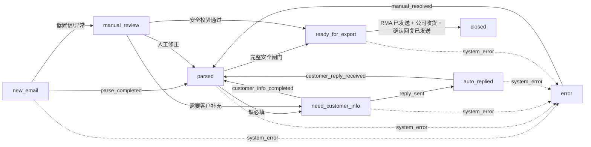

# 邮件报修自动化项目现状与代码审计报告

> 审计日期：2026-07-27  
> 审计对象：`D:\db_test\repair-mail-agent` 当前工作树（含未提交修改）  
> Git 基线：分支 `codex-new-database`，HEAD `503e906`  
> 审计原则：代码、ORM、Alembic、自动化测试和前端类型优先于文档；未连接真实 IMAP、SMTP、OSS、AI、MySQL 或 SQL Server；未修改业务代码。  
> 结论标记：**事实**表示代码或命令可直接证明；**推断**表示基于多处事实的合理判断；**风险**表示尚未实际触发但具备触发条件；**建议**不代表当前已实现。
>
> 后续核验更新：审计后 `repair_system_test` 已迁移到 `e2f6a7b8c9d0`，数据库 smoke 通过，后端全量 JUnit 为 `256 tests, 0 failures, 0 errors, 3 skipped`。详细业务链路和当前数据库残留规则见 `docs/07-完整业务流程与工单状态流转.md`；下文涉及旧测试门禁和“未连接 MySQL”的描述仅代表原始审计时点。

## 1. 执行摘要

项目已经不是“只有骨架”的原型。邮件归档、解析、工单、人工复核、安全校验、RMA、通知、后台任务和 SQL Server 中继均有实质代码，前端也覆盖主要业务页面。其主要问题是：**功能面较完整，但生产闭环、权限边界、当前测试门禁和文档一致性仍不足以支持无条件上线。**

综合当前工作树评估：

| 维度 | 估算完成度 | 判定 |
|---|---:|---|
| 业务功能代码覆盖 | 78% | 主链代码广，但自动多轮催补、生产邮件信封、部分异常闭环未完成 |
| 数据模型与迁移 | 86% | 31 张 ORM 业务表、单一迁移 head；测试库已核验，生产库未核验 |
| 前端业务覆盖 | 80% | 主要页面和人工操作齐备；大包、令牌存储及端到端验收不足 |
| 外部系统生产联调 | 38% | 接口代码存在，但本轮未做真实联调；SMTP/RMA 明确固定为测试信封 |
| 安全与权限成熟度 | 48% | 有 JWT、bcrypt、服务端 RBAC、日志脱敏；仍有明文凭据、授权粒度和部署基线问题 |
| 自动化验证可信度 | 70% | 后端全量 256 项零失败、前端门禁通过；真实外部集成仍不足 |
| 文档可信度 | 62% | 关键口径大体可用，但迁移 head、线程策略、Relay 状态和 README 明显滞后 |
| **综合真实完成度** | **约 66%** | **适合继续受控开发/测试，不建议直接生产上线** |

**当前 P0/P1 阻塞：**

1. 仓库测试脚本含明文 SMTP 凭据，应立即轮换并清理历史。
2. 后端全量测试门禁已恢复；真实 IMAP/SMTP/OSS/AI/Relay 集成仍不是默认发布门禁。
3. SMTP/RMA 的发送者和收件者被代码固定为测试邮箱，生产客户邮件闭环尚未实现。
4. 人工复核界面提供“关闭工单”，代码种子已删除 `manual_close`，但测试库残留旧规则，导致环境行为不一致并可能绕过正常闭环。
5. SQL Server 表模式仅“存在即成功”，同一工单后续版本无法覆盖远端旧快照。
6. 自动催补配置和 job handler 存在，但没有任何生产调度或入队路径。

## 2. 审计范围与方法

已检查：

- Git 分支、提交历史、当前未提交改动。
- `README.md`、`docs/00` 至 `docs/05` 以及历史审计资料。
- FastAPI API、服务层、ORM、Alembic、种子状态机、运行配置。
- React 页面、API 客户端、认证状态、角色感知逻辑。
- IMAP、EML、OSS、附件、DeepSeek、Qwen、SMTP、RMA、SQL Server Relay。
- 工单、人工复核、通知、审计日志、异步任务和调度器。
- 安全基线、依赖版本、明文敏感信息、资源上限。
- 后端 pytest、前端 typecheck/build。

未做：

- 未读取或披露真实 `.env` 密钥。
- 未连接或更改任何真实数据库、邮箱、OSS、AI 或中继系统。
- 未执行真实发信、拉信、数据库迁移或数据修复。
- 未进行负载测试、渗透测试或三角色浏览器 E2E。

## 3. 当前代码与 Git 基线

**事实：**

- 当前 HEAD 为 `503e906`，最近提交已经覆盖关单线程隔离、SMTP 规则、RMA PDF、IMAP 持久化、SQL Server Relay、安全导出、通知、后台任务和附件多模态解析。
- 当前工作树有大量业务代码、测试、文档和前端未提交修改，本报告以这些修改后的文件为审计对象。
- 本轮仅新增本报告，不改动或整理用户已有修改。

**风险：** 当前工作树不是可复现提交点。若随后文件继续变化，本报告中的行号和结论需要按新提交复核。

## 4. 技术架构现状

| 层 | 当前实现 |
|---|---|
| 前端 | React 18、TypeScript、Vite、Ant Design、Axios、Zustand |
| API | FastAPI 0.115、Pydantic、统一 `/api/v1` 路由 |
| 业务层 | 邮件、工单、解析、复核、回复、安全闸门等 service |
| 数据层 | SQLAlchemy 2 async、MySQL、Alembic |
| 后台任务 | 数据库队列 `job_run_logs` + 应用内 APScheduler worker |
| 文件 | 阿里云 OSS 对象表、原始 EML/附件/RMA PDF |
| AI | DeepSeek 邮件级结构化；Qwen 附件文本/视觉解析 |
| 外部系统 | IMAP、SMTP、SQL Server/ODBC Relay |
| 部署 | Docker Compose、Nginx、单 backend 容器 |

架构主线清晰，确定性服务和状态机负责落库/流转，AI 只产生候选。这一边界总体正确。

## 5. 文档、代码和提交历史一致性

**一致部分：**

- 当前确有 8 个主状态，而不是旧设计中的 `exported`。
- 归档失败阻断正式邮件入库、线程精确关联、压缩包只归档不解析、RMA/收货闭环均已进入代码。
- `docs/01` 已明确行级数据隔离尚未实现。

**不一致部分：**

- `README.md:101` 仍写迁移 `9d2b7c4f1a30` 和 27 张表。
- `docs/01:50`、`docs/02:60` 仍写本地 head `a8b2c3d4e5f6`，实际 `alembic heads` 为 `d1e5f6a7b8c9`。
- `docs/00:153` 仍描述按主题和发件域匹配线程；实际 `emails.py:180-235` 只允许 `References/In-Reply-To → Message-ID` 精确关联。
- `docs/01:68,313` 仍称 Relay 为占位；当前已有真实 ODBC 查询、同步和写入逻辑。
- 历史测试通过数字不能代表当前工作树；当前全量 pytest 在收集阶段失败。

## 6. 前端完成度

已存在首页、邮件、工单、人工复核、回复、通知、AI 日志、统计、主数据、用户和系统配置页面。人工复核页不是简单的状态展示，已经支持：

- 邮件/工单/附件/证据时间线。
- 附件预览和下载。
- 解析候选采纳、部分采纳和拒绝。
- 工单字段、明细修改和 SN 校验。
- 重新解析、生成追问和任务解决。

**不足：**

- 没有独立前端测试脚本或组件/E2E 门禁。
- 生产包主 JS 约 1.54 MB（gzip 约 486 KB），Vite 给出大包告警。
- Token 存在 `localStorage`，一旦出现 XSS，Bearer Token 可被直接读取。
- 前端角色隐藏只能改善体验，不能替代后端授权；部分后端写接口当前授权不足。

## 7. 后端 API 与服务完成度

API 已覆盖认证、用户、邮件、线程、工单、解析结果、人工复核、回复、主数据、AI 日志、通知、统计、系统配置、任务和数据库浏览。

服务层大多有明确事务、审计和错误码，尤其以下实现较成熟：

- 原始 EML/附件完整归档后才创建正式邮件。
- Message-ID、原文 hash、IMAP UID/UIDVALIDITY 多层幂等。
- 工单安全快照/hash 与下游 job 版本绑定。
- SMTP 不确定发送结果不自动重试。
- 已关闭工单的精确回复会创建新线程，避免直接污染旧工单。

主要缺口集中在权限粒度、跨服务状态一致性、任务调度和生产配置。

## 8. 数据库模型与迁移

**事实：**

- ORM/文档列出 30 张业务表，覆盖用户角色、OSS、邮件、工单、状态审计、AI、任务、通知、Relay。
- Alembic 迁移链单头，当前 head 为 `d1e5f6a7b8c9`。
- 关键唯一约束包括邮件 `message_id`、原文 hash、IMAP UID 四元组、工单号、状态迁移规则、通知用户状态和 Relay 本地快照。
- 工单字段有 `version`，状态变化和字段修改可形成审计。

**未验证：**

- 当前真实/测试 MySQL 是否已经到 `d1e5f6a7b8c9`。
- ORM、迁移和远程实际 schema 是否完全一致。
- 数据量下的索引选择性、锁等待和迁移时间。

**数据建模缺口：**

- `reply_records` 缺少可防止并发重复 RMA/同轮回复的数据库唯一约束。
- `manual_review_tasks` 仅依赖查询实现“同类型开放任务”幂等，并发仍可能重复。
- 工单明细更新没有客户端版本条件，弱于工单字段的乐观锁。

## 9. 配置、部署与运行边界

**事实：**

- 配置默认值含 `change-me` 数据库、JWT 和管理员口令。
- 应用启动没有对这些默认敏感值做生产拒绝。
- Nginx 只监听 HTTP 80，仓库内未配置 TLS、安全响应头或 Host 限制。
- Nginx 请求体上限为 512 MB，后端单邮件归档上限为 500 MB。
- 数据库引擎设置 `pool_pre_ping=False`。

这些配置适合开发环境，不构成生产安全基线。若 TLS、WAF、Host 校验由外部网关完成，应在部署文档和验收证据中明确。

## 10. 认证、角色与数据权限

**已实现：**

- bcrypt 密码散列。
- 有有效期的签名 JWT。
- 每次请求重新查询 active 用户和角色，停用账号可立即失效。
- `require_roles()` 在管理员、系统配置、主数据导入、状态流转和人工复核等接口使用。

**不足：**

- `tickets.py:151-179` 的字段和明细修改仅要求登录。
- `tickets.py:227-233` 的 SN 校验仅要求登录。
- `tickets.py:348-358` 的解析结果应用仅要求登录。
- 数据查询普遍没有按业务归属过滤；`docs/01:84,99` 也明确承认行级隔离未建模。

当前系统只有 admin/supervisor/operator 三种角色，通常每个账号至少有角色，因此“无角色用户”不是主要场景；但后端接口契约仍应显式表达所需权限，并为未来角色变化提供安全默认值。

## 11. 邮件拉取、EML 与 OSS 归档

IMAP 链路实现度较高：

1. SSL IMAP、只读 `SELECT`、`BODY.PEEK[]`，不主动改已读状态。
2. 先按 UIDVALIDITY/UID 和重试时间排除已处理记录，再应用批量上限。
3. MySQL `GET_LOCK` 防止多实例同时拉同一邮箱。
4. 每封邮件独立归档、入库和提交，单封失败不回滚整批。
5. 失败采用 5/15/60/180/720 分钟退避并记录 `mail_fetch_records`。

原始 EML 使用标准库解析，附件和 inline CID 可识别；正文解码失败使用 replacement，保证入库但可能损失少量原文字符。

**缺口：** 达到最大重试后主要依靠任务/拉取记录排查，没有明确的人工任务和通知升级闭环。

## 12. 预检查、去重和无关邮件

**事实：**

- 去重依据包括规范化 Message-ID 和 raw 内容 SHA-256。
- 高置信无关邮件只有在无有效附件、无业务明细、无回复头时才会预筛跳过。
- 预筛跳过邮件不会创建 `emails` 正式记录，只保留最小 `mail_fetch_records`/操作审计。
- 可疑、低置信或有附件的邮件继续归档、入库并进入解析/人工路径。

该策略兼顾 OSS 成本和漏单风险，但“最小审计”必须被运维页面或告警覆盖，否则业务方难以追溯被跳过邮件。

## 13. 邮件线程与关闭工单隔离

线程自动关联仅使用 `References` 或 `In-Reply-To` 精确匹配已有 Message-ID；主题和发件域仅存储/搜索，不用于归并。这比模糊主题归并更安全。

如果精确父邮件属于已关闭工单，入库时直接创建新线程。由此产生两个结果：

- **正确结果：** 新邮件不会自动写回已关闭工单。
- **代码冗余：** `reparse_email()` 中的 `closed_thread` 人工分支对新入库邮件通常不可达，因为入库阶段已经切成没有旧 ticket 的新线程。

线程合并 API 明确返回 410；拆分 API 可用，但新线程会复制源线程 `ticket_id`。若业务期待拆分后形成独立工单，当前实现不满足。

## 14. 附件解析能力

| 类型 | 当前行为 |
|---|---|
| DOCX/XLSX | ZIP 安全上限检查后本地抽取，再交 Qwen |
| CSV/TXT/HTML/PRC | 本地限量抽取，必要时 Qwen 结构化 |
| 图片 | 使用短期 OSS 预签名 URL 调 Qwen VL |
| PDF | pypdf 提取文本；扫描件用 PyMuPDF 渲染后视觉解析 |
| ZIP/RAR/7Z/TAR/GZ | 仅识别、私有归档、标为 `unscanned_archive`，不解压、不扫描、不解析 |
| DOC/XLS 等旧格式 | 不在支持集合，转 unsupported/人工 |

DOCX/XLSX 有成员数、展开大小和压缩比上限。普通压缩容器没有解压，所以不存在解压目录穿越和临时目录清理问题；但也无法识别加密包、恶意成员或包内业务信息。

## 15. AI 提取与置信度

**事实：**

- DeepSeek 输出受 Pydantic schema 约束，意图、字段、明细、缺失、冲突、置信度和证据均持久化。
- Qwen 负责附件级文本/视觉解析，超时、429、5xx、非 JSON 和 schema 失败有有限重试。
- 确定性附件结果会与模型结果合并并检测冲突。
- 自动采纳使用独立阈值 `AUTO_APPLY_MIN_CONFIDENCE=0.85`。
- AI 不可用时不会丢邮件，而是创建人工复核工单。

**风险：**

- 总置信度和多数单字段置信度仍来自模型自报，代码只做范围约束，没有独立校准。
- 邮件正文和附件可能包含 prompt injection；schema、安全闸门和人工路径降低了影响，但不能证明模型提取语义正确。
- 客户正文/附件会发送给外部模型，需明确数据处理协议、地域、保留期和敏感数据政策。

## 16. 工单创建、编辑与并发

工单号按日期和日序号生成，并依赖 `workflow_statuses.new_email` 行锁实现正常环境下的串行化。工单字段修改支持 `version` 乐观锁，修改后使安全快照失效。

**并发缺口：**

- `upsert_ticket_items()` 不接收期望版本；两个用户同时编辑明细时可能覆盖彼此结果。
- 某些服务直接设置 `current_status_code=manual_review` 以使导出快照失效，而不是统一走状态转换表；虽然写日志和任务，但状态机入口并未完全单一。

## 17. 真实工单状态机

当前主状态只有：

`new_email`、`parsed`、`need_customer_info`、`auto_replied`、`manual_review`、`ready_for_export`、`error`、`closed`。

**不存在 `exported` 主状态。** 外部中继结果、RMA 和收货确认分别记录在子状态字段中。

任意非终态可在规则允许时转人工或 error；closed 无出边。

## 18. 人工复核闭环

人工复核任务有 pending/assigned/claimed/resolved 等状态、负责人、通知、证据和审计。处理动作覆盖转可导出、等待客户、生成追问、重解析和保持人工。

**确定性缺陷：** `manual_review.py` 的 `close_ticket` 请求 `manual_review → closed / manual_close`，而当前代码种子没有该迁移。全新数据库会返回 `WORKFLOW_TRANSITION_NOT_ALLOWED`；当前测试库因初始化不清理历史规则而残留该迁移，反而可能成功。两种行为都与统一状态机要求冲突。

应由产品决定：

- 删除人工关闭动作，坚持“只有设备收货确认邮件发送成功才关闭”；或
- 新增明确的取消/误报终止状态，而不是复活语义冲突的 `manual_close`。

## 19. 客户补充与自动催补

首次缺字段时可以生成追问草稿，发送成功后 `need_customer_info → auto_replied`；客户精确回复后重新解析并补写同一工单。追问次数只在确认发送成功后增加，这一设计正确。

但 `AUTO_FOLLOWUP_ENABLED`、`AUTO_FOLLOWUP_INTERVAL_MINUTES` 和 `auto_followup` job handler 并没有对应的周期扫描或生产入队调用。即：

- 初次事件驱动追问已实现。
- 人工触发追问已实现。
- **超时后的自动第二轮/多轮催补未实现。**

## 20. SMTP 回复与不确定发送

SMTP 支持 465 SSL 和 587 STARTTLS，发送前后重复校验信封、发件登录和白名单。外发 EML 在网络发送前先归档；异常返回 `SMTP_SEND_FAILED_UNCERTAIN`，不自动重试，避免重复发信。

当前实现明确是测试环境：

- 发件登录必须精确为固定测试发送邮箱。
- 收件者必须精确为固定测试接收邮箱，Cc/Bcc 为空。
- 普通回复和 RMA ReplyRecord 均会写固定测试收件者，而不是工单客户邮箱。

因此“SMTP 代码存在”不能等价为“生产邮件可用”。

## 21. RMA PDF 与设备收货

新报修通过完整安全闸门后可排队生成双语 RMA PDF，记录模板版本、工单版本、安全 hash 和 OSS 对象。RMA job 默认仅尝试一次；失败转人工。

设备收货语义是“公司收到客户寄来的待修设备”。只有：

1. 工单已经 `ready_for_export`；
2. RMA 状态为 `sent`；
3. 设备收货已确认；
4. 收货确认回复 SMTP 发送成功；

才能通过 `device_receipt_ack_sent` 进入 `closed`。该闭环比旧文档中的“客户收到维修设备”更准确。

生产阻塞仍是固定测试信封，以及真实 RMA 模板、字体、OSS、SMTP 联调尚无本轮证据。

## 22. 安全导出与 SQL Server Relay

`ready_for_export` 表示安全快照已通过，并不表示已导出。进入该状态会按配置创建：

- `ticket_relay_exports` 版本/hash 快照；
- Relay 导出 job；
- 新报修 RMA job。

SQL Server SN 同步支持增量游标 `(updated_at, primary_key)` 和全量失效标记；标识符经过白名单正则，值使用参数绑定。

表模式写出存在重要一致性问题：`external_relay.py:181-189` 以配置的唯一字段查询，若存在就直接返回成功，不执行 UPDATE。默认唯一 payload key 为 `ticket_no`。同一工单被修改、重新校验并产生新 version 后，远端旧行仍会被当成成功复用。

## 23. 后台任务、调度与可靠性

任务队列有幂等 key、`FOR UPDATE SKIP LOCKED`、陈旧锁恢复、失败重试和结果记录。handler 覆盖邮件解析、IMAP、SMTP、导入导出、Relay 和 RMA。

运行方式是 FastAPI 进程内 APScheduler：

- 每 tick 最多 claim 10 个任务。
- AI、IMAP、SMTP、导入等慢任务共享同一 worker。
- 多 backend 实例会各自启动 scheduler；部分场景依赖数据库锁/幂等抵消重复。
- 缺少独立 worker 的容量、隔离、优雅停机和背压能力。

小规模测试可用；生产需做多实例、重启、长任务、重复调度和积压压测。

## 24. 日志、通知和审计

系统有状态日志、字段审计、操作日志、系统事件、任务运行、邮件拉取和 AI 调用日志。AI 数据库日志保存摘要，完整 JSONL 有字段级脱敏、数量/长度限制和 30 天维护逻辑。

需要继续验证：

- 生产卷权限、备份和删除是否生效。
- 管理员读取完整 AI 日志是否完整审计。
- SMTP 不确定结果人工对账后，外发邮件时间线和关联人工任务是否同步收口。
- IMAP 最终失败、路由无人接单和任务长期积压是否都有明确告警。

## 25. 安全审计结论

已有安全控制：

- JWT 签名和过期验证、active 用户复查、bcrypt。
- 高危 API 的部分服务端 RBAC。
- SQL Server 值参数化和标识符验证。
- OSS 私有对象、短期签名 URL。
- SMTP 测试信封硬限制和不确定结果禁止自动重试。
- AI 日志对密钥、认证头、签名 URL、base64 等敏感类型做清洗。
- DOCX/XLSX ZIP bomb 上限和附件/邮件大小上限。

主要安全缺口：

- 测试脚本提交明文 SMTP 凭据。
- 默认 JWT/数据库/管理员口令不阻止启动。
- 部分业务写接口只要求登录。
- Token 存 localStorage。
- CORS `*` 与 credentials 同时启用，缺少可信 Host、HTTPS 强制和安全头。
- Starlette 0.38.6、python-multipart 0.0.12 等版本需按当前公告升级核验。
- 未扫描压缩包仍可由授权用户下载。
- 上传上限过大，可能造成内存、网络、OSS 和 AI 资源耗尽。

## 26. 性能与容量

重点风险：

- `ticket_safety.py:179-224` 对最多 300 个明细逐项查询 SnAsset、BoardCard，并可能逐项访问远端 Relay，形成显著 N+1 和串行网络延迟。
- FastAPI 进程内 worker 每轮只取 10 条，慢任务之间互相争用。
- 前端主包 1.54 MB，首屏加载和低带宽体验受影响。
- Nginx/后端允许 500 MB 级邮件，且 `proxy_request_buffering off`、超时 600 秒。
- `pool_pre_ping=False` 增加空闲连接失效后的首请求错误概率。

## 27. 当前测试与验证结果

本轮实际命令：

| 门禁 | 当前结果 | 说明 |
|---|---|---|
| 后端全量 `python -m pytest -q` | **后续已通过** | JUnit：256 tests，0 failures，0 errors，3 skipped |
| 定向纯本地单元测试 | **52 passed, 1 warning** | business rules、precheck、EML parser、AI regression、workflow assignment、attachment parser |
| 前端 `npm run typecheck` | **通过** | TypeScript 无错误 |
| 前端 `npm run build` | **通过但告警** | 主 JS 约 1.54 MB |
| Alembic head 与测试库 current | **后续已通过** | 单头并已迁移到 `e2f6a7b8c9d0` |
| MySQL smoke | **后续已通过** | `repair_system_test`；其他外部服务仍未执行 |

全量 pytest 的两个收集阻断：

1. `backend/test_login_full.py` 在模块导入时直接 `asyncio.run(test())`，并连接 `127.0.0.1` MySQL；连接拒绝会使整个测试收集失败。
2. `tests/test_api_contract.py` 的导入链加载 `rma_pdf.py`/PyMuPDF，本机 `_mupdf` DLL 无法加载。

测试体系以 mock 单元测试为主，真实集成测试受环境和开关控制；仓库未发现 CI workflow。历史 `200/228/236 passed` 只能证明当时快照，不能替代当前门禁。

## 28. 典型业务场景判定

| 场景 | 当前真实行为 | 完整性 |
|---|---|---|
| 新报修，字段/SN 完整 | 归档→规则/Qwen/DeepSeek→建单→SN/安全闸门→ready→RMA/Relay job | 代码主链完整，真实外部联调不足 |
| 缺字段 | 建单→need_customer_info→草稿→审核/发送→auto_replied | 首轮完整；定时多轮催补缺失 |
| 客户补充 | 精确邮件头归线程→重解析→补写旧工单→再校验 | 代码存在；真实端到端仍待验收 |
| AI 低置信/冲突 | 创建/更新工单→manual_review task→人工修正/采纳/重解析 | 基本完整 |
| 无关邮件 | 高置信且无业务信号时只留最小审计，不正式入库 | 已实现，需运营可见性 |
| ZIP/RAR/7Z | 私有归档、unscanned、跳过模型、不阻塞 | 按当前口径完成，但不是安全扫描 |
| 已关闭工单收到精确回复 | 入库时创建新线程，通常按新邮件意图继续处理 | 隔离完成；后续归属仍需人工语义 |
| 人工直接关闭 | 新库无规则会失败；测试库残留旧规则可能成功 | **环境不一致且可绕过闭环** |
| 设备收到 | 前置不满足时 pending+人工；满足后发确认，成功才 closed | 代码完整，受测试 SMTP 限制 |
| Relay 重复导出同一版本 | 本地 version/hash 幂等 | 完整 |
| Relay 导出同工单新版本 | 远端按 ticket_no 发现旧行即成功，不更新 | **数据一致性缺陷** |

## 29. 详细问题清单

### AUD-001 明文 SMTP 凭据进入仓库

- 严重度：**P0 / Critical**
- 类型：安全、凭据管理
- 位置：`backend/tests/send_test_email.py:24-27`
- 触发条件：任何可读取工作树或 Git 历史的人获取该文件。
- 实际行为：外部 SMTP 主机、账号和明文密码在代码中定义。
- 期望行为：仓库只保留环境变量名和无效示例值。
- 根因：真实测试脚本被作为普通文件加入工作树。
- 影响范围：测试邮箱、可能的同域资源、发信信誉和审计可信度。
- 数据/业务阻塞：应视为凭据已经泄露；未轮换前不应进行真实联调。
- 临时绕过：立即停用/轮换该凭据并限制测试账号权限。
- 修复建议：从文件及 Git 历史清理；使用 Secret Manager/CI secret；增加 secret scanning 和 pre-commit 门禁。

### AUD-002 人工关闭动作与状态机相冲突

- 严重度：**P1 / High**
- 类型：业务、状态机、前后端契约
- 位置：`manual_review.py:290-299`；`seed.py:123-168`；迁移 `c0d4e5f6a7b8`
- 触发条件：人工任务选择 `close_ticket`。
- 实际行为：请求 `manual_review → closed / manual_close`；新库无规则，当前测试库残留旧规则。
- 期望行为：UI/API 只暴露合法动作，或使用业务定义的终止状态。
- 根因：关单规则收紧后未同步人工动作。
- 影响范围：人工误报/取消场景无法完成，用户看到确定性 400。
- 数据/业务阻塞：阻塞相关工单收口，但不会静默破坏数据。
- 临时绕过：保持人工任务开放并记录原因，走合法设备收货闭环。
- 修复建议：产品确认后删除动作，或新增 `cancelled/rejected` 终态及完整迁移、API、UI、测试。

### AUD-003 后端全量测试门禁无法运行

- 严重度：**P1 / High**
- 类型：测试、工程质量
- 位置：`backend/test_login_full.py:1-36`；`tests/test_api_contract.py` 导入链；PyMuPDF 运行环境
- 触发条件：执行仓库标准 `pytest`。
- 实际行为：导入即连 MySQL失败；PyMuPDF DLL 加载失败；测试收集中断。
- 期望行为：默认测试完全离线、可收集，真实集成测试显式 marker/环境开关。
- 根因：脚本命名和副作用不符合 pytest 约定；二进制依赖环境未固定。
- 影响范围：无法证明当前全量回归，CI 也无法可靠建立。
- 数据/业务阻塞：阻塞发布门禁。
- 临时绕过：定向执行纯本地测试；不能把该结果宣称为全量通过。
- 修复建议：脚本移出 pytest 路径并加 `if __name__ == "__main__"`；为集成测试设 marker；固定 PyMuPDF 系统依赖和镜像 smoke。

### AUD-004 SMTP/RMA 仍是固定测试信封

- 严重度：**P1 / High**
- 类型：业务完整性、外部集成
- 位置：`mail_safety.py:8-48`；`replies.py:289-400,893,1229`
- 触发条件：尝试向真实客户发送普通回复、RMA 或收货确认。
- 实际行为：非固定测试发送者/接收者全部拒绝。
- 期望行为：生产环境按客户地址发送，同时保留可审计的域/租户/白名单策略。
- 根因：为受控真实测试而硬编码的安全措施尚未产品化。
- 影响范围：所有真实客户邮件闭环。
- 数据/业务阻塞：生产上线硬阻塞。
- 临时绕过：只允许受控测试邮箱，不对外宣称生产发送完成。
- 修复建议：环境分层；测试环境继续硬限制，生产环境用显式 allowlist/policy engine、双人审批和灰度开关。

### AUD-005 自动多轮催补没有调度或入队

- 严重度：**P1 / High**
- 类型：业务缺失、任务调度
- 位置：`config.py:35,131`；`jobs.py:19-20,225`；仓库无 `job_type="auto_followup"` 入队调用
- 触发条件：工单等待客户补充超过设定时间。
- 实际行为：不会自动创建下一轮追问任务。
- 期望行为：按 interval、最大次数、发送状态和幂等 key 周期扫描。
- 根因：只实现配置和 handler，缺少生产者。
- 影响范围：客户补充超时工单，依赖人工发现。
- 数据/业务阻塞：不阻塞首轮，但阻塞自动化目标。
- 临时绕过：人工筛选并生成追问。
- 修复建议：增加定时扫描、行锁/幂等、时区和退避规则，并覆盖重启/并发测试。

### AUD-006 Relay 新版本被旧远端行错误复用

- 严重度：**P1 / High**
- 类型：数据一致性、外部集成
- 位置：`external_relay.py:166-191`
- 触发条件：同一 ticket_no 已导出后，工单被修改、重新校验并再次导出。
- 实际行为：远端查询到旧行即返回 succeeded，不更新内容。
- 期望行为：以 ticket_no+version/hash 唯一，或按版本条件 UPDATE/MERGE。
- 根因：把“工单号幂等”错误等同于“快照版本幂等”。
- 影响范围：下游系统可能长期持有过时客户、物料、SN 或故障数据。
- 数据/业务阻塞：可造成跨系统业务错误，应阻塞 Relay 生产启用。
- 临时绕过：人工删除/更新远端旧行并对账。
- 修复建议：采用存储过程 MERGE 或带 version/hash 的乐观更新；保存远端确认版本并做差异告警。

### AUD-007 工单写接口授权过宽

- 严重度：**P1 / High**
- 类型：授权、业务数据
- 位置：`api/v1/tickets.py:151-179,227-233,348-358`
- 触发条件：active 登录用户调用字段、明细、SN 校验或解析采纳接口。
- 实际行为：只检查登录，不显式要求 operator/supervisor。
- 期望行为：所有业务写操作使用明确角色/权限依赖。
- 根因：部分端点沿用通用 `get_current_user`。
- 影响范围：未来无角色账号或新增只读角色时可越权写数据。
- 数据/业务阻塞：当前三角色模型降低触发概率，但属于安全默认值缺陷。
- 临时绕过：确保所有 active 用户至少分配受信角色。
- 修复建议：统一写接口 permission matrix，并做无角色/低权限 API 合同测试。

### AUD-008 缺少行级业务数据隔离

- 严重度：**P1 / High（取决于部署组织边界）**
- 类型：授权设计、隐私
- 位置：`docs/01:84,99`；邮件、工单、任务列表 service
- 触发条件：多个客户、部门或租户共享实例，operator 不应查看全部数据。
- 实际行为：operator 基本可查看和处理全量业务数据。
- 期望行为：按租户、部门、队列、负责人或客户范围过滤。
- 根因：模型没有稳定的业务归属字段和策略。
- 影响范围：客户邮件、附件、联系人、SN 和维修数据。
- 数据/业务阻塞：单团队内部系统可接受；多租户/跨部门上线硬阻塞。
- 临时绕过：网络和账号层限制为单一受信团队。
- 修复建议：先定义 ownership/tenant 模型，再统一 query scope；禁止散落式条件过滤。

### AUD-009 默认敏感配置可直接启动

- 严重度：**P1 / High**
- 类型：安全配置
- 位置：`config.py:16-20,154`；`.env.example:13-25,161`
- 触发条件：部署遗漏环境变量。
- 实际行为：使用可预测数据库、JWT 和管理员默认值。
- 期望行为：非开发环境发现 placeholder 即拒绝启动。
- 根因：配置没有环境级强校验。
- 影响范围：认证令牌伪造、管理员账号、数据库访问。
- 数据/业务阻塞：生产部署硬阻塞。
- 临时绕过：部署平台强制 Secret 注入并做启动前检查。
- 修复建议：增加 `APP_ENV` 和 fail-fast validator；禁止默认管理员密码长期存在。

### AUD-010 浏览器 Token 保存在 localStorage

- 严重度：**P2 / Medium**
- 类型：前端安全、会话管理
- 位置：`frontend/src/stores/authStore.ts:11-24`
- 触发条件：同源页面发生 XSS 或恶意依赖执行。
- 实际行为：脚本可读取长期 Bearer Token。
- 期望行为：短期 access token + HttpOnly/Secure/SameSite refresh cookie，或等价受保护会话。
- 根因：前端单页应用采用简单持久化。
- 影响范围：用户会话及其可访问业务数据。
- 数据/业务阻塞：需结合 token TTL、CSP 和部署风险评估。
- 临时绕过：缩短 token TTL、严格 CSP、禁止不受信脚本。
- 修复建议：迁移 HttpOnly 会话设计并加入注销/轮换/CSRF 策略。

### AUD-011 CORS、HTTP 和安全响应头基线不足

- 严重度：**P2 / Medium**
- 类型：Web/部署安全
- 位置：`main.py:198-204`；`nginx/default.conf:10-43`
- 触发条件：服务直接暴露或外部网关未补齐控制。
- 实际行为：CORS origins 为 `*` 且 credentials=true；HTTP 80；无仓库内 Host/CSP/HSTS 等配置。
- 期望行为：显式来源、可信 Host、TLS 和安全响应头。
- 根因：开发配置直接作为部署模板。
- 影响范围：浏览器跨域行为、Host header、降级和内容注入防护。
- 数据/业务阻塞：若外部网关完整托管可降级；否则生产阻塞。
- 临时绕过：仅内网暴露并由受控反向代理补齐。
- 修复建议：按环境生成严格 CORS，加入 TrustedHost，明确 TLS 终止点和 CSP/HSTS。

### AUD-012 Web 依赖版本需要安全升级验证

- 严重度：**P2 / Medium**
- 类型：依赖安全
- 位置：`requirements.txt:1,11`；本机 FastAPI 0.115.0、Starlette 0.38.6、python-multipart 0.0.12
- 触发条件：攻击者提交特制 multipart/form-data 或命中旧版框架已知缺陷。
- 实际行为：当前解析栈版本低于后续 Starlette/python-multipart 多项安全修复版本。
- 期望行为：锁定受支持且已修复版本并执行兼容回归。
- 根因：依赖长期未做安全基线更新，Starlette 为传递依赖。
- 影响范围：上传接口可用性和进程资源。
- 数据/业务阻塞：需结合官方公告/SBOM 确认，当前应按升级项处理。
- 临时绕过：网关限制请求体、字段数、速率和连接时长。
- 修复建议：引入依赖扫描，升级 FastAPI/Starlette/python-multipart，回归 UploadFile、Range/FileResponse 和 API 合同。

### AUD-013 未扫描压缩包仍可下载

- 严重度：**P2 / Medium**
- 类型：文件安全、业务边界
- 位置：`attachment_precheck.py:81-147`；`attachment_parser.py:523-561`
- 触发条件：攻击者发送含恶意内容的 ZIP/RAR/7Z，授权员工下载并打开。
- 实际行为：系统正确标记 `unscanned_archive`，但不做恶意文件扫描。
- 期望行为：隔离区、恶意扫描、下载警告和可审计放行。
- 根因：当前范围只做工程资料归档。
- 影响范围：操作员终端和后续人工处理环境。
- 数据/业务阻塞：不阻塞 RMA 主链，但属于办公终端安全风险。
- 临时绕过：UI 强警告，要求在隔离沙箱打开。
- 修复建议：接入 AV/CDR/沙箱；扫描前禁止普通下载或使用一次性隔离下载。

### AUD-014 SN 校验存在串行 N+1

- 严重度：**P2 / Medium**
- 类型：性能、外部依赖
- 位置：`ticket_safety.py:171-224`
- 触发条件：工单接近 300 个明细，尤其开启实时 Relay 查询。
- 实际行为：逐项查询资产、板卡并逐项等待远端。
- 期望行为：本地批量查询、远端批量协议或有界并发。
- 根因：校验按单条直写，未围绕批量工单设计。
- 影响范围：校验延迟、数据库连接、SQL Server 压力。
- 数据/业务阻塞：大工单可能超时，阻塞 ready。
- 临时绕过：限制单工单明细数量或关闭实时 Relay、使用本地镜像。
- 修复建议：两次批量 SELECT + 映射；Relay 提供批量 SN 接口和超时/熔断。

### AUD-015 工单明细缺少乐观并发控制

- 严重度：**P2 / Medium**
- 类型：数据一致性
- 位置：`api/v1/tickets.py:170-179`；`tickets.py:691-736`
- 触发条件：两个操作员同时编辑同一工单明细。
- 实际行为：后提交者可能覆盖前一提交，接口没有 expected version。
- 期望行为：字段和明细共享工单 version 条件，冲突返回 409。
- 根因：字段 patch 和明细 patch 的并发模型不一致。
- 影响范围：SN、物料、故障描述和安全快照。
- 数据/业务阻塞：可能造成隐蔽数据丢失。
- 临时绕过：人工任务同一时刻只由一人处理。
- 修复建议：明细 patch 强制 version；事务锁定工单并原子递增。

### AUD-016 后台任务与 Web 进程耦合

- 严重度：**P2 / Medium**
- 类型：可靠性、扩展性
- 位置：`main.py` lifespan/scheduler；`jobs.py`
- 触发条件：多实例、worker 重启、慢 AI/SMTP/IMAP、任务积压。
- 实际行为：每个 API 进程启动调度器，慢任务共享有限 claim 循环。
- 期望行为：独立 worker、leader election、队列容量和停机恢复指标。
- 根因：从单实例原型演进而来。
- 影响范围：吞吐、重复执行、延迟和 API 稳定性。
- 数据/业务阻塞：小规模可用，生产规模未知。
- 临时绕过：保持单 backend 实例并监控 job backlog。
- 修复建议：拆 worker，或至少增加数据库 leader lock、任务分类并发和积压告警。

### AUD-017 上传和归档上限过大

- 严重度：**P2 / Medium**
- 类型：资源耗尽、成本
- 位置：`config.py:60-67`；`nginx/default.conf:13,28-30`
- 触发条件：合法或恶意用户重复上传大 EML/附件。
- 实际行为：单邮件可达 500 MB，代理超时 600 秒且关闭请求缓冲。
- 期望行为：符合真实业务分位数的上限、流式处理、配额和速率限制。
- 根因：为兼容大样本设置宽松上限。
- 影响范围：内存、网络、临时资源、OSS 成本、worker 饥饿。
- 数据/业务阻塞：可导致服务可用性下降。
- 临时绕过：网关做更小的身份化限制和速率限制。
- 修复建议：采集实际文件分布，分入口设限；对大文件走异步直传/隔离扫描。

### AUD-018 文档基线已滞后

- 严重度：**P2 / Medium**
- 类型：文档、交付治理
- 位置：`README.md:101`；`docs/00:153`；`docs/01:50,68,313`；`docs/02:60`
- 触发条件：开发、运维或 AI 按正式文档做迁移/验收。
- 实际行为：表数量、迁移 head、线程策略和 Relay 能力互相矛盾。
- 期望行为：当前事实只有一个版本，历史结果移入 outdated。
- 根因：代码快速演进但文档未做同提交更新。
- 影响范围：迁移、测试、排期和上线判断。
- 数据/业务阻塞：可能导致错迁移或错误验收。
- 临时绕过：以 `alembic heads`、ORM、seed 和当前测试结果为准。
- 修复建议：发布检查强制校验 README/docs 的 head、表数、状态和测试基线。

### AUD-019 缺少仓库级 CI 门禁

- 严重度：**P2 / Medium**
- 类型：工程质量、供应链
- 位置：仓库未发现 `.github/workflows` 等 CI 配置
- 触发条件：合并或部署新改动。
- 实际行为：测试、类型检查、构建、迁移单头和 secret scan 依赖人工执行。
- 期望行为：PR 必须通过自动门禁。
- 根因：本地开发流程尚未产品化。
- 影响范围：所有模块。
- 数据/业务阻塞：当前全量测试已经失败，进一步说明需要 CI。
- 临时绕过：发布前人工保存完整命令输出。
- 修复建议：建立 pytest 离线层、前端 typecheck/build、Alembic heads、依赖/secret scan 和镜像 smoke。

### AUD-020 前端主包过大

- 严重度：**P3 / Low**
- 类型：前端性能
- 位置：Vite build 输出
- 触发条件：首次打开应用或缓存失效。
- 实际行为：主 JS 约 1.54 MB。
- 期望行为：页面级懒加载和合理 chunk。
- 根因：所有 Ant Design 页面同步打包。
- 影响范围：低带宽和低性能终端。
- 数据/业务阻塞：无。
- 临时绕过：内网部署和长期缓存。
- 修复建议：React.lazy 路由拆包、manualChunks、bundle analyzer。

## 30. 修复路线与验收标准

### P0：立即处理（当天）

1. 轮换测试脚本中的 SMTP 凭据，确认发送日志和异常活动。
2. 从工作树和历史提交清理敏感值；开启 secret scanning。
3. 暂停任何真实发信和 Relay 生产启用，直到 P1 门禁通过。

### P1：发布阻塞（1～2 个迭代）

1. 修复 pytest 收集，建立完全离线的默认全量测试。
2. 决定人工关闭业务语义并同步 seed、迁移、API、UI、测试。
3. 将测试信封和生产信封做环境隔离，完成真实客户地址安全策略。
4. 修复 Relay 的 version/hash 更新语义和跨系统对账。
5. 为所有业务写接口补齐显式权限；若存在跨部门/多客户，先落地行级模型。
6. 实现自动催补生产者、扫描计划、幂等和最大轮次。
7. 加生产配置 fail-fast：默认 JWT/管理员/数据库口令不得启动。

### P2：上线前完成

1. 升级和扫描 Web 依赖，补 TrustedHost、严格 CORS、TLS/安全头说明。
2. 批量化 SN/板卡/Relay 校验，加入超时和容量测试。
3. 工单明细纳入 version 乐观锁。
4. 压缩包接入隔离扫描或明确禁止普通终端直接打开。
5. 拆分或加固后台 worker，完成多实例、重启和积压测试。
6. 把 README/docs 00～05 更新为 `d1e5f6a7b8c9` 和当前真实口径。
7. 建立 CI：后端、前端、迁移、依赖、secret scan、Docker smoke。

### 上线验收的最小证据

- 当前提交点后端全量离线测试通过，且真实集成测试与离线测试分层。
- 前端 typecheck/build/E2E 三角色关键路径通过。
- Alembic current=head，ORM/迁移/目标库 30 表及关键约束一致。
- 测试、预发布、生产凭据完全隔离，无仓库明文秘密。
- 新报修、缺字段、客户补充、人工复核、RMA、收货关闭各至少一条真实受控链路。
- SMTP 不确定结果、OSS失败、AI失败、Relay失败、worker重启、重复邮件均有可核对证据。
- Relay 同一工单新版本能正确更新或生成新远端版本。
- 权限矩阵包含匿名、无角色、operator、supervisor、admin；如为多组织，包含跨组织拒绝用例。
- 生产网关的 TLS、Host、CORS、CSP/HSTS、限流和上传上限经配置审查。

---

**最终判断：** 项目核心业务代码已经进入“可进行系统联调和缺陷收敛”的阶段，不是推倒重做项目；但当前仍处于受控测试产品，而不是可直接承接真实客户邮件和下游数据的生产系统。优先解决凭据、全量测试、测试信封、状态机冲突、Relay 版本一致性和自动催补后，才适合重新评估上线完成度。
