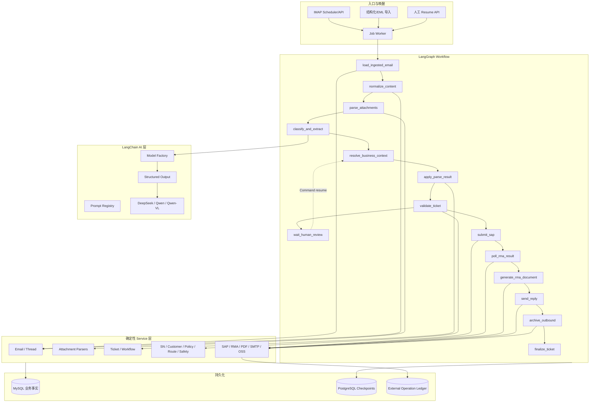
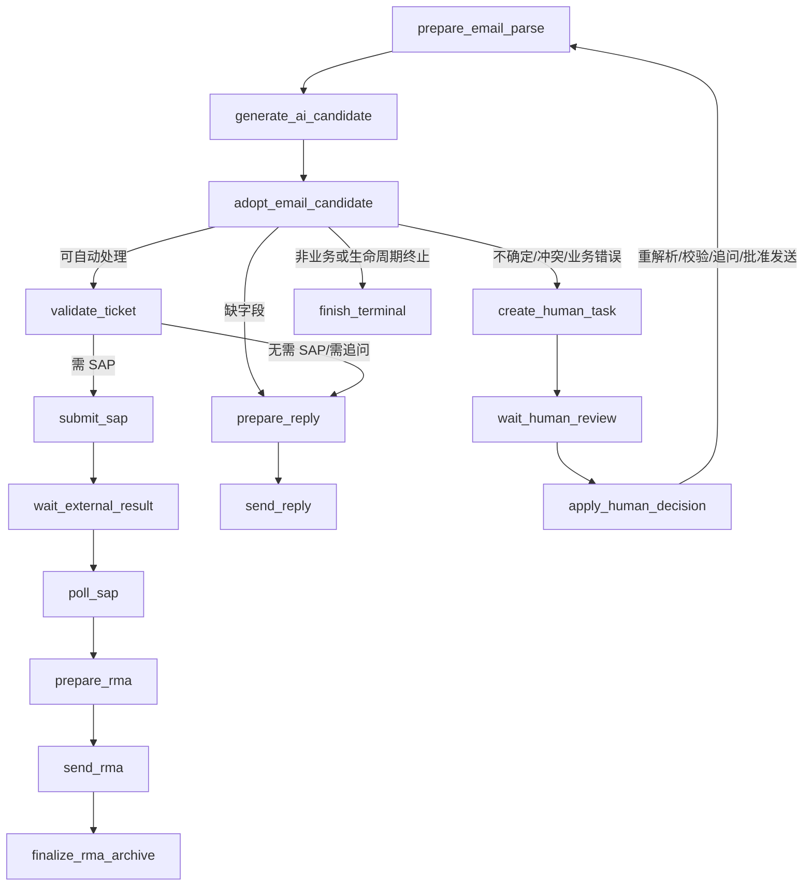

# LangChain + LangGraph 重构方案

> 设计基线：`docs/06-当前代码业务流程与状态体系分析.md`  
> 目标：LangGraph 负责编排和执行状态，LangChain 统一模型能力，普通 Service 保留确定性业务逻辑，MySQL 保存业务事实，PostgreSQL 保存 Graph checkpoint。  
> 迁移方式：影子对照后灰度，不推倒重写。

## 1. 重构目标与约束

重构完成后的职责必须满足：

```text
LangGraph = 流程编排、条件路由、暂停恢复、执行上下文
LangChain = 模型工厂、结构化输出、prompt、模型异常、调用观测
Business Service = 规则、校验、状态转换、事务和外部系统实现
MySQL = 邮件、工单、人工任务、SAP/RMA/SMTP 等业务事实
PostgreSQL Checkpointer = Graph checkpoint 和 pending writes
```

不改变以下已有语义：

- 工单 10 个主状态及其合法转换；
- FIRST 自动报修、SECOND 人工业务、生命周期邮件的业务边界；
- RFC Header 精确线程关联优先；
- OSS 完整归档后才正式入库；
- SN、客户、政策、状态、SAP、RMA、SMTP 使用确定性代码；
- RMA 关闭必须满足现有六项事实门禁；
- SMTP 白名单和测试安全限制。

## 2. 目标架构



Graph 不直接拼 SQL、发送 SMTP、生成 PDF 或调用 SAP adapter。Node 负责加载必要 DTO、调用 Service、把结果映射回 State；Router 只读取 State 中已确定的结果。

## 3. 模块边界与目录调整

结合当前仓库，不创建无意义深层目录。目标新增/调整为：

```text
backend/app/
├── ai/
│   ├── models.py          # 模型配置、能力枚举、factory
│   ├── gateway.py         # structured invoke、重试、异常和 usage
│   ├── schemas.py         # 分类、抽取、回复、附件理解输出
│   └── prompts.py         # prompt 注册和版本
├── workflows/
│   └── email_ticket/
│       ├── state.py       # Graph State / Context DTO
│       ├── nodes.py       # 薄 Node
│       ├── routers.py     # 纯确定性 Router
│       ├── graph.py       # StateGraph 构建和编译
│       ├── runtime.py     # start/resume/status 与 checkpointer 注入
│       └── errors.py      # 工作流异常映射
├── services/
│   ├── attachment_parser.py  # 渐进拆分，保留兼容 façade
│   ├── emails.py             # 渐进移出编排，保留 API façade
│   └── ...                   # 现有确定性 Service
└── integrations/
    └── ...                   # SAP/SMTP/OSS adapter，AI 厂商 HTTP 层最终淘汰
```

现有 API 不直接 import Graph 节点；统一调用 workflow runtime。旧 `reparse_email` 在迁移期作为 legacy façade 保留。

## 4. Graph State 设计

### 4.1 State Schema

```python
class EmailTicketGraphState(TypedDict, total=False):
    schema_version: str
    execution_id: str
    graph_thread_id: str
    correlation_id: str

    email_id: int
    email_thread_id: int | None
    ticket_id: int | None
    predecessor_ticket_id: int | None
    parse_result_id: int | None
    manual_task_id: int | None

    trigger: str
    execution_mode: Literal["shadow", "active"]
    current_stage: str

    normalized_content: NormalizedEmailContent
    attachment_results: list[AttachmentResultRef]
    ai_result: AiParseResult
    business_context: BusinessContextResult
    apply_result: ParseApplyResult
    validation_result: TicketValidationResult
    human_request: HumanReviewRequest | None
    human_result: HumanReviewResult | None

    sap_result: ExternalStepResult | None
    rma_result: ExternalStepResult | None
    reply_result: ExternalStepResult | None
    archive_result: ExternalStepResult | None

    route: str | None
    error: WorkflowErrorInfo | None
    retry_counts: dict[str, int]
    completed_nodes: list[str]
```

State 中的复杂对象全部是 JSON 可序列化 DTO。ID 之外只保存该次路由必需的小型快照。正文只保存经过长度限制和脱敏策略的标准化内容；完整正文和附件仍从 MySQL/OSS 按 ID 读取。

### 4.2 State、Runtime Context 与数据库

- State：可 checkpoint 的执行数据。
- Runtime Context：Session factory、Service registry、model gateway、feature flags、logger；不写入 checkpoint。
- MySQL Model：业务事实，Node 每次按 ID 重新读取并进行版本检查。
- PostgreSQL checkpoint：Graph 快照，不参与工单查询或报表。

### 4.3 Graph execution 与业务状态映射

| Graph Stage | 工单主状态可能值 | 说明 |
|---|---|---|
| `load_ingested_email` / `normalize_content` | 无工单或 `new_email` | 仅执行阶段，不创建新业务状态 |
| `classify_and_extract` | 无工单、`new_email`、既有状态 | AI 执行阶段不能作为工单状态 |
| `validate_ticket` | `parsed` / `manual_review` / `need_customer_info` / `ready_for_export` | 由现有 Workflow Service 决定业务转换 |
| `waiting_human_review` | 通常 `manual_review`，也可为已关闭工单的 sidecar task | Graph 等待态不覆盖业务状态 |
| `submit_sap` / `poll_rma_result` | `ready_for_export` | 细节由 relay/RMA 子状态表达 |
| `send_reply` / `archive_outbound` | `ready_for_export` / `rma_sent` | 发送和归档状态独立 |
| `completed` | `closed`、`resolved` 或邮件级终止 | Graph 结束不等于工单关闭 |

## 5. Node 设计

| Node | 职责 | 输入 State | 输出 State | 调用 Service | LLM | 副作用 | 异常策略 |
|---|---|---|---|---|---|---|---|
| `load_ingested_email` | 加载邮件、线程和关联工单小型 DTO，验证归档完整性 | email_id | IDs、business context seed | Email/Thread Service | 否 | 否 | 缺失事实终止；暂时 DB 错误重试 |
| `normalize_content` | 生成最新回复正文和规范化内容 | email_id | normalized_content | Email Parser | 否 | 否 | 解析异常转附件/内容人工 |
| `parse_attachments` | 调用 parser router，聚合结果引用 | email_id | attachment_results | Attachment Service | 条件式 | 解析结果入库 | 高风险/不支持转人工；临时 AI 错误重试 |
| `classify_and_extract` | 语义分类和字段/明细抽取 | normalized content、attachment refs、thread seed | ai_result、parse_result_id | AI Gateway、AI log Service | 是 | AI/Parse 日志 | schema 修复一次；失败转人工 |
| `resolve_business_context` | 结合分类、线程、活动/前序工单确定业务分支 | ai_result、IDs | business_context、route | Classification/Thread Service | 否 | 否 | 不确定转人工 |
| `record_email_terminal` | 保存 irrelevant/lifecycle/post-close 结果和关联 | business_context | terminal result | Email Service | 否 | MySQL | 幂等 upsert；DB 错误重试 |
| `apply_parse_result` | 按现有字段锁、版本和补充规则采纳候选 | parse_result_id、ticket_id | ticket_id、apply_result | Ticket Service | 否 | MySQL | 版本冲突转人工或重载 |
| `validate_ticket` | 必填、SN、客户、政策、返修路由、安全门 | ticket_id | validation_result、route | Validation Services | 否 | MySQL | 业务失败分流；系统失败重试/人工 |
| `prepare_followup` | 选择追问模板，必要时生成自然语言草稿 | ticket_id、validation | reply result | Reply Service、AI Gateway | 条件式 | 草稿入库 | 达上限转人工；AI 失败模板 fallback/人工 |
| `create_human_task` | 以 execution/reason 幂等创建或复用任务 | human_request | manual_task_id | Manual Review Service | 否 | MySQL/通知 | 唯一键复用；失败重试 |
| `wait_human_review` | 发送结构化 interrupt 并校验 resume payload | manual_task_id、human_request | human_result | LangGraph interrupt | 否 | 无 | 不捕获 interrupt；非法输入继续中断 |
| `apply_human_result` | 把人工编辑/动作交给现有 Service | human_result | 更新后的 IDs/context | Ticket/Manual Services | 否 | MySQL | 版本冲突重新中断 |
| `prepare_sap_export` | 固化 ticket version、safety hash、source IDs | ticket_id | sap operation refs | SAP Service | 否 | MySQL | 门禁失败人工；快照变化 supersede |
| `submit_sap` | 查询台账后提交，记录明确/未知结果 | operation refs | sap_result | SAP Service | 否 | SAP/中转写入 | 未知只对账；可重试使用退避 |
| `poll_rma_result` | 按 source request IDs 回查 RMA | sap_result | rma_result | SAP/RMA Service | 否 | 外部读取/MySQL | 等待使用 Job 唤醒；超时人工 |
| `generate_rma_document` | 生成、校验、归档确定性 PDF | ticket/rma refs | PDF refs | RMA PDF/OSS Service | 否 | OSS/MySQL | 幂等复用；完整性失败人工 |
| `send_reply` | 使用稳定 Message-ID 和 operation ledger 发信 | reply/PDF refs | reply_result | Reply/SMTP Service | 否 | SMTP/MySQL | uncertain 禁止重发，进入对账 |
| `archive_outbound` | 归档出站 EML，独立重试且不再发信 | reply_result | archive_result | Email/OSS Service | 否 | OSS/MySQL | 可重试；终态失败人工 |
| `finalize_ticket` | 调用现有门禁转换 `rma_sent/closed/resolved` | 所有事实 refs | completed | Workflow Service | 否 | MySQL/通知 | 缺门禁保持当前状态并人工 |
| `record_workflow_error` | 记录统一错误与恢复动作 | error | route/stage | Logging/Execution Service | 否 | MySQL | 按错误分类重试、人工或终止 |

Node 不返回下一节点名；分支统一由 conditional edge/router 表达。唯一例外是 LangGraph 标准 `Command(resume=...)` 输入，不在业务 Service 内硬编码 goto。

### 5.1 最终权威 Graph（as-built）

上表表达目标能力边界；渐进迁移完成后的实际权威节点如下，名称以代码为准：

| 实际 Node | 最终职责 | 主要 Service | LLM | 副作用/恢复 |
|---|---|---|---|---|
| `prepare_email_parse` | 建立规则解析与附件阶段上下文 | Email/Attachment Service | 否 | MySQL；execution marker 复用 |
| `generate_ai_candidate` | 基于统一 Gateway 生成结构化候选 | AI Service | 是 | AI/Parse 日志；candidate marker 复用 |
| `adopt_email_candidate` | 采纳候选、关联/创建工单或终止邮件 | Email/Ticket Service | 否 | MySQL；adoption marker 防重放 |
| `validate_ticket` | 执行 SN、客户、完整性、政策和路由门禁 | Validation Service | 否 | MySQL；业务错误进入 HITL |
| `submit_sap` | 首次提交 SAP/中转请求 | SAP Service | 否 | 外部写；operation/source ID 幂等 |
| `reconcile_sap` | 对账不确定提交，禁止盲目重提 | SAP Service | 否 | 外部读/MySQL |
| `wait_external_result` | 通过 interrupt 持久等待下一次轮询 | LangGraph interrupt | 否 | 无业务副作用 |
| `poll_sap` | 查询 RMA 结果或继续等待 | SAP/RMA Service | 否 | 外部读/MySQL |
| `prepare_rma` | 生成并归档确定性 RMA PDF/待发回复 | Reply/RMA PDF/OSS Service | 否 | MySQL/OSS；稳定 reply 与模板版本 |
| `send_rma` | 发送已准备的 RMA 邮件 | SMTP/Reply Service | 否 | SMTP；稳定 Message-ID 与 ledger |
| `finalize_rma_archive` | 单独完成出站归档与关单门禁 | Reply/OSS/Workflow Service | 否 | OSS/MySQL；不重复发信 |
| `prepare_reply` | 创建/复用追问或普通回复草稿 | Reply Service | 条件式 | MySQL；复用待审/待发草稿 |
| `send_reply` | 发送已审批普通回复 | SMTP/Reply Service | 否 | SMTP；uncertain 转人工 |
| `create_human_task` | 幂等创建或复用人工任务 | Manual Review Service | 否 | MySQL/通知 |
| `wait_human_review` | 结构化 interrupt | LangGraph interrupt | 否 | 无业务副作用 |
| `apply_human_decision` | Graph 恢复后应用字段编辑/状态动作 | Ticket/Manual Service | 否 | MySQL；版本冲突再中断 |
| `finish_*` | 记录 execution outcome，不复用工单状态字段 | Execution/Workflow Service | 否 | MySQL |

所有非 interrupt 权威节点都有 started/result/duration/error/route-delta 事件；interrupt 本身由 `workflow_interrupts` 表记录。

## 6. Router 设计

| Router | 判断依据 | Route A | Route B | Route C | 确定性 |
|---|---|---|---|---|---|
| `route_load_result` | 归档/邮件事实 | normalize | terminal duplicate | error | 是 |
| `route_attachment_result` | parser status 和风险码 | classify | human | retry/error | 是 |
| `route_intent` | normalized intent/handling level | terminal/lifecycle | auto repair | SECOND/unknown human | 是 |
| `route_thread_context` | RFC 关联、active/predecessor ticket | existing ticket | new ticket | orphan/post-close human | 是 |
| `route_parse_quality` | confidence、missing、conflict、附件状态 | apply | follow-up path | human | 是 |
| `route_validation` | Validator 结构化结果 | ready for SAP | need customer info | human/error | 是 |
| `route_followup` | followup count 和 draft/send policy | wait customer | human | error | 是 |
| `route_human_result` | 结构化 next_action | reparse/validate | follow-up | external finish/terminal | 是 |
| `route_sap_result` | status/retryable/uncertain | poll | reconcile/retry | human | 是 |
| `route_rma_result` | RMA 完整性和超时 | generate PDF | wait | human | 是 |
| `route_send_result` | ledger/send status | archive | reconcile | retry/human | 是 |
| `route_archive_result` | PDF/EML 归档事实 | finalize | retry | human | 是 |

Router 只判断 DTO，不访问模型；需要数据库事实时由前置 Node 先调用 Service 加载。

## 7. Human-in-the-loop

### 7.1 中断协议

`wait_human_review` 的 payload 仅包含 JSON 数据：

```json
{
  "schema_version": "1",
  "execution_id": "...",
  "manual_task_id": 123,
  "ticket_id": 456,
  "email_id": 789,
  "reason_code": "SN_VALIDATION_FAILED",
  "allowed_actions": ["reparse", "validate", "generate_followup", "keep_manual_review"],
  "version": 7
}
```

Resume payload：

```json
{
  "manual_task_id": 123,
  "action": "validate",
  "resolution": "已修正 SN",
  "patch": {"fields": {}, "items": []},
  "expected_ticket_version": 7,
  "operator_user_id": 9
}
```

恢复必须使用同一 `graph_thread_id` 和 `Command(resume=payload)`。Node 从头重跑，因此 `interrupt()` 之前不能创建任务、发通知或修改工单；这些操作放在独立、幂等的 `create_human_task` Node。

### 7.2 兼容现有 UI/API

- 保留 `/manual-review/tasks/{id}/resolve` 请求结构。
- API 对已绑定 Graph interrupt 的任务只保存结构化审核决定并 enqueue `graph_resume`；字段编辑、状态转换和重新校验在 `apply_human_decision` 节点中执行。未绑定任务继续使用 legacy Service，支持灰度共存。
- API 响应增加可选 `workflow_execution` 字段，不删除旧 `task/ticket/followup_result/reparse_result` 字段。
- legacy 执行没有 execution 关联时仍走现有逻辑，直到灰度结束。

## 8. Checkpointer 与执行登记

### 8.1 PostgreSQL Checkpointer

- 生产使用官方异步 PostgreSQL saver，并在部署阶段执行其 `setup()`/迁移。
- 单元测试使用 `InMemorySaver`；本地可使用独立开发 PostgreSQL，不将 SQLite 作为生产方案。
- checkpoint connection 与业务 MySQL Session 分离；任何一方不可参与另一方业务事务。
- checkpoint state 启用加密 serializer 时，密钥只从环境变量读取并支持轮换方案。

### 8.2 MySQL 新增最小业务关联

新增 `workflow_executions`：

- `id`（UUID/string PK）、`graph_thread_id`（unique）；
- `workflow_name`、`workflow_version`、`state_schema_version`；
- `email_id`、`ticket_id`、`trigger_job_id`；
- `execution_mode`（shadow/active）、`status`（queued/running/interrupted/waiting_external/completed/failed/cancelled）；
- `current_node`、`last_route`、`last_error_code`；
- `started_at`、`updated_at`、`completed_at`；
- `input_fingerprint`、`legacy_comparison_id`。

新增 `workflow_interrupts`：

- execution、manual task、interrupt namespace/ID；
- reason code、payload snapshot、status；
- resume payload、operator、created/resumed timestamps；
- `(execution_id, manual_task_id, status)` 查询索引。

业务表只增加可选外键/关联，不把 checkpoint JSON 复制到 MySQL。迁移需同步 ORM、Alembic、删除关系测试和 `docs/02`。

## 9. LangChain 模型层

### 9.1 配置和能力选择

统一配置模型：

```text
AI_TEXT_PROVIDER / AI_TEXT_MODEL / AI_TEXT_BASE_URL
AI_ATTACHMENT_TEXT_PROVIDER / AI_ATTACHMENT_TEXT_MODEL
AI_VISION_PROVIDER / AI_VISION_MODEL
AI_TIMEOUT_SECONDS / AI_MAX_RETRIES / AI_MAX_TOKENS
AI_CLASSIFY_TEMPERATURE / AI_EXTRACT_TEMPERATURE / AI_REPLY_TEMPERATURE
AI_STRUCTURED_OUTPUT_METHOD / AI_PROMPT_VERSION_*
```

现有 `AI_*`、`QWEN_*` 环境变量在兼容期映射到新配置并记录 deprecation warning，不立即破坏部署。

业务代码按 capability 请求模型：

- `EMAIL_CLASSIFICATION_EXTRACTION` → DeepSeek 或 Qwen text；
- `ATTACHMENT_TEXT_UNDERSTANDING` → Qwen text；
- `ATTACHMENT_VISION` → Qwen-VL；
- `REPLY_DRAFT` → DeepSeek/Qwen text。

### 9.2 Structured Output

每个能力固定：Input DTO、Output Pydantic Schema、prompt version、capability、校验、异常和 fallback。

调用优先级：

1. provider 支持时使用 `with_structured_output(..., method="json_schema")`；
2. 兼容接口只支持 JSON mode 时使用 `method="json_mode"`，仍由 LangChain parser/Pydantic 校验；
3. schema 错误最多执行一次低温修复；
4. 失败返回统一 `AIOutputInvalid` 并路由人工。

禁止业务 Service 对模型文本执行 `json.loads`。AI 日志仍保留 trace、usage、延时和脱敏后的输入输出摘要。

### 9.3 异常

统一异常基类和路由属性：

- `WorkflowBusinessError`：不可重试的业务条件；
- `WorkflowValidationError`：输入/状态/版本不合法；
- `AIServiceError` / `AIOutputInvalid`：按错误码决定重试或人工；
- `AttachmentError` / `UnsafeArchiveError`：人工或终止；
- `ExternalServiceError`：确定失败；
- `ExternalResultUncertain`：不得重做，必须对账；
- `RetryableWorkflowError`：有限退避；
- `HumanReviewRequired`：生成统一 human request；
- `TerminalWorkflowError`：记录后终止。

Graph 层捕获并映射已知异常；未知异常统一记录 sanitized code，不能把堆栈或凭据写入 State。

## 10. 附件 Parser 目标设计

```text
OSS Object
→ FileTypeDetector（扩展名 + MIME + 魔数）
→ SafetyInspector
→ BinaryParser
→ NormalizedAttachmentContent
→ SemanticUnderstanding（必要时）
→ Business Extraction 输入
```

### 10.1 解析规则

- PDF：先提取文本和基础版面；无文本/扫描页才渲染后调用 Qwen-VL；表格可确定性提取时不走视觉。
- DOCX：段落、表格、页眉页脚和内嵌图片分开提取；仅图片或难理解片段进入视觉。
- XLSX/XLS：保留 workbook/sheet/row/cell 结构和截断元数据；结构数据不送视觉模型。
- TXT/CSV/HTML/PRC：确定性解析，只有业务语义抽取需要模型。
- 图片：先检测尺寸、格式和安全限制，再 OCR/VL；装饰图片继续跳过。
- 不支持格式：保留元数据并进入人工，不伪造解析成功。

### 10.2 压缩包

当前落地为 ZIP/TAR/GZIP 使用标准库，7Z 使用受控纯 Python reader，RAR 使用只读 reader（运行环境缺少可用解压后端时明确转人工）。统一限制：

- 禁止绝对路径、`..`、symlink/hardlink 和设备文件；
- 限制原始大小、成员数、单成员大小、总展开大小和压缩比；
- 限制嵌套深度，默认 2；
- 加密、损坏、未知格式直接人工；
- 成员使用内容哈希去重，同名文件保留稳定 member path；
- 每个成员再进入 FileTypeDetector，结果按 archive/member tree 聚合；
- 临时目录只在受控目录创建并在 finally 清理；不执行任何附件内容。
- 子文件重新进行魔数/扩展名路由；文本/表格/Office 优先确定性解析，图片和扫描 PDF 才进入视觉模型。聚合结果写回父附件 JSON，不创建虚构 ORM 子附件。

## 11. 确定性 Service 复用

直接复用并只补 DTO/幂等接口：

- Email/Thread：入库、线程、post-close link；
- Ticket/Workflow：字段采纳、状态转换、状态日志；
- SN/Customer/Policy/Route/Safety：所有业务判断；
- SAP：snapshot、source request ID、提交/对账/轮询；
- RMA/PDF：号码合法性、模板、生成、校验；
- Reply/SMTP：模板、父邮件、白名单、稳定 Message-ID、发送和归档；
- OSS：上传、下载、签名 URL 和删除；
- Manual Review/Notification：任务、分配和通知。

Node 不复制这些实现。需要事务原子性时由 Service 提供一个明确的 unit-of-work 方法，Graph 不管理局部 ORM 字段。

## 12. Side Effect 幂等与恢复

| 副作用 | 幂等身份 | 执行前检查 | 未知结果处理 | 重试规则 |
|---|---|---|---|---|
| 邮件正式入库 | Message-ID + raw hash | Email 唯一查询 | 返回已存在记录 | 不重复创建 |
| 附件/EML OSS | content hash + source identity | OSS object 记录 | 对象 HEAD/台账核对 | 复用已成功对象 |
| ParseResult 采纳 | parse_result + ticket version | apply_status/version | 人工核对冲突 | 已采纳不重复 |
| 工单创建 | source email + category/context | 现有关联 | 人工处理歧义 | 唯一/锁保护 |
| 人工任务 | execution + reason + ticket/email | open task 查询/唯一键 | 复用任务 | 不重复通知 |
| SAP 提交 | source_request_id + payload hash | export/operation ledger | 远端按 request ID 对账 | 未知禁止重提 |
| RMA PDF | ticket + version + rma_no + template version | TicketRma/PDF hash | OSS/DB 对账 | 相同输入复用 |
| SMTP | reply ID + stable Message-ID | operation ledger/send status | `send_uncertain` 人工/对账 | 不自动重发 uncertain |
| 出站归档 | reply ID + Message-ID + raw hash | Email/OSS 记录 | OSS/DB 对账 | 可重试且不调用 SMTP |

所有副作用 Node 的第一步是读取业务台账，最后一步才返回 State。Graph checkpoint 写失败后重跑 Node 时，必须先识别已成功事实。

## 13. API、前端与可观测性影响

### 13.1 API

现有 API 路径和主要响应保持稳定。新增：

- `GET /workflow-executions/{id}`：执行状态和当前等待原因；
- `GET /workflow-executions/{id}/history`：节点/route/error 摘要，不直接暴露 checkpoint；
- 内部 job type：`graph_start`、`graph_resume`、`graph_continue_external`。

手动 reparse、ingest 和 IMAP job 在 feature flag 开启时启动 Graph；关闭时调用 legacy Service。

### 13.2 前端

- 补充 `resolved` 工单标签/颜色；
- 人工任务详情可选展示 execution、当前节点和 resume 状态；
- System 页面展示 shadow/active 开关和 Graph/checkpointer 健康状态；
- 不要求重写 Tickets、Emails、Replies 页面。

### 13.3 可观测性

每个节点记录：`execution_id`、`graph_thread_id`、`email_id`、`thread_id`、`ticket_id`、node、route、attempt、start/end/duration、result summary、error、human interrupt、model、tokens、external operation key。

默认复用现有结构化日志、SystemEventLog、OperationLog、AiCallLog 和 ExternalOperationRecord。LangSmith 只作为可选配置，不是运行依赖。

## 14. 分阶段迁移与文件范围

### Phase 0：审计与基线（当前阶段）

- 新增本文和现状审计文档。
- 固化 pytest、前端 typecheck/build、OpenAPI 和金标结果。
- 不创建 State/Node/Workflow。

### Phase 1：LangChain AI Gateway

- 升级并锁定当前稳定的 LangChain/LangGraph 兼容组合。
- 新增 `app/ai/*`，迁移 DeepSeek/Qwen/Qwen-VL structured output。
- `services/ai.py`、`attachment_parser.py` 先通过兼容 façade 调用 Gateway。
- 测试：Model factory、structured output、retry、schema invalid、Fake ChatModel、旧响应兼容。

### Phase 2：附件标准化

- 提取 detector、safety、binary parser、normalized schema 和 semantic understanding。
- 保持现有 `parse_attachment` 对外签名。
- 加入安全压缩包解析和 DOCX/XLSX 结构增强。
- 测试每种格式、加密/损坏/炸弹/路径穿越/嵌套/重复/空文件。

### Phase 3：无副作用 Shadow Graph

- 此阶段才新增 `app/workflows/email_ticket/*`。
- Graph 执行到 validation plan 为止，不采纳业务状态、不发外部请求。
- 新旧流程使用同一已归档输入，保存结构化 diff。

### Phase 4：邮件、工单和校验接管

- Active Graph 接管解析、分类、采纳、校验和追问草稿。
- 外部副作用仍由 legacy 路径执行。
- 修复前端 `resolved` 映射。

### Phase 5：HITL

- 新增 workflow execution/interrupt migration、PostgreSQL checkpointer 和 resume bridge。
- 人工 UI/API 兼容 legacy/graph 双模式。

### Phase 6：SAP/RMA

- 将已有 SAP snapshot、submit、reconcile、poll 和 RMA/PDF Service 包装为幂等 Node。
- 先测试未知提交与 checkpoint 失败，再开放灰度。

### Phase 7：SMTP/出站归档

- 最后迁移发送和归档。
- 单独测试 SMTP 成功后 Graph/DB 失败、send uncertain 和 archive retry。

### Phase 8：全量切流与旧编排清理

- shadow → 手工入口 → IMAP 小比例 → 全量。
- 全局搜索确认无调用后，删除 `reparse_email` 中被 Graph 取代的流程分支和旧 Provider HTTP/JSON 层。
- 保留所有确定性 Service 和兼容 migration。

每阶段修改后必须运行对应单测、全量 pytest、前端检查、`git diff --check`，并输出修改清单和剩余任务。

## 15. 测试方案与验收门槛

### 15.1 单元测试

- 每个 Node：输入 DTO、Service 调用、State delta、异常映射；
- 每个 Router：所有 route 值和默认拒绝；
- AI：Fake ChatModel、native schema、JSON mode、修复失败、timeout/429/5xx；
- Parser：PDF/DOCX/XLSX/图片/TXT/PRC/压缩包和安全边界；
- 幂等：相同 key 重入和版本变化。

### 15.2 Workflow 测试

- 正常 FIRST 完整报修到 END；
- irrelevant、SECOND、lifecycle、unknown；
- 缺信息、3 轮追问和上限；
- AI 低置信度/无响应/schema invalid；
- SN 不存在、多 SN、客户冲突、政策/路由异常；
- 附件损坏、超大、加密、压缩炸弹；
- post-close 新报修、终态事件、修改请求；
- interrupt、服务重启、resume、重复 resume、版本冲突；
- SAP failed/unknown/waiting/partial；
- RMA/PDF failed；
- SMTP failed/uncertain、归档失败。

### 15.3 新旧对照

对同一 EML 比较：

- intent/subtype/handling level；
- extracted fields/items 和 evidence；
- missing/conflict；
- thread/ticket 关联；
- 目标工单状态、人工原因；
- SAP/RMA/SMTP 的“计划”，shadow 模式绝不实际执行。

差异必须归类并签收；未知差异阻断切流。全量切流前要求关键金标场景无未解释差异，所有副作用重入测试通过。

## 16. 发布与回滚

- Feature flags：`WORKFLOW_ENGINE=legacy|shadow|langgraph`、入口 allowlist/percentage、外部节点独立开关。
- shadow 只读计算，不写工单状态、不创建人工任务、不执行外部副作用。
- 灰度时一个 email/execution 只能选定一个主编排器，使用 input fingerprint 防止双执行。
- 回滚只阻止新输入进入 Graph；已在 Graph 中且完成副作用的执行继续由同版本恢复或进入人工，不能切回 legacy 重做。
- 保留 checkpoint、execution 和 external ledger，禁止为回滚清空历史。
- Graph workflow version 和 State schema version 固化；不兼容升级通过显式 migrator 或让旧版本 worker 完成旧执行。

## 17. 五项最高风险及控制

1. **外部操作重复**：复用/强化 ledger、稳定业务 key、unknown 对账，副作用 Node 重入测试。
2. **状态语义漂移**：所有业务状态转换继续经过 `transition_ticket`，Graph stage 不写入工单 status。
3. **人工恢复到错误执行**：execution/manual task/checkpoint 三方绑定，ticket version 乐观锁，重复 resume 拒绝。
4. **线程和关闭工单误关联**：保留 RFC 精确匹配和 predecessor 规则，shadow 比较关联结果。
5. **LangChain/LangGraph 升级行为变化**：先隔离 Gateway、锁版本、Fake/contract 测试，再迁移调用方。

## 18. 完成定义

### 18.1 当前代码落地映射（2026-08-12）

设计能力已按真实代码收敛为以下权威活动链：



- 正文规范化、附件解析和规则候选生成保留在 `prepare_email_parse_context` Service 内部，因为它们共享现有持久化阶段、durable commit 与解析日志；Graph Node 只编排调用。
- 线程、前序工单、关闭后邮件、FIRST/SECOND/lifecycle/orphan 和采纳规则封装在 `adopt_email_candidate` 调用的确定性 Service 中。
- SAP 快照与 source request ID 继续由现有 validation/SAP Service 维护，Graph 只保存 `export_id` 等引用。
- RMA/PDF、SMTP、归档已拆成 `prepare_rma`、`send_rma`、`finalize_rma_archive` 三个副作用边界。
- 活动执行使用 `workflow_outcome`；`shadow_outcome` 仅服务影子对照与旧图兼容。
- `app/workflows/email_ticket/errors.py` 将可人工修正的确定性错误写入小型 JSON State 并路由 HITL；瞬时基础设施错误继续由 Job 重试。
- 跨 MySQL/PostgreSQL 不使用分布式事务：Node 先提交 MySQL 业务事实再返回给 checkpointer；若 checkpoint 写失败则重放 Node，并依赖稳定业务键、operation ledger 和状态门禁返回已有结果。
- 灰度选择采用 email ID 稳定分桶与显式 allowlist；显式重解析生成新的 execution ID，同一 Job 的重试继续复用原 execution ID。

只有以下证据同时存在才可删除 legacy 主编排并宣布完成：

- LangGraph 是所有邮件工单新执行的唯一编排层；
- Graph State、工单状态和子状态边界经测试证明；
- DeepSeek/Qwen/Qwen-VL 均通过 LangChain Gateway；
- 分类/抽取使用 structured output，业务层无模型 JSON 字符串解析；
- 人工任务可 interrupt、服务重启后 resume，且不重复副作用；
- SAP、RMA、SMTP、OSS 重入/未知结果测试通过；
- 附件 parser 和压缩包安全测试通过；
- 新旧金标对照无未解释差异；
- 后端、前端、迁移和构建全部通过；
- 全局搜索证明旧编排无运行时调用，并完成可回滚发布记录。
