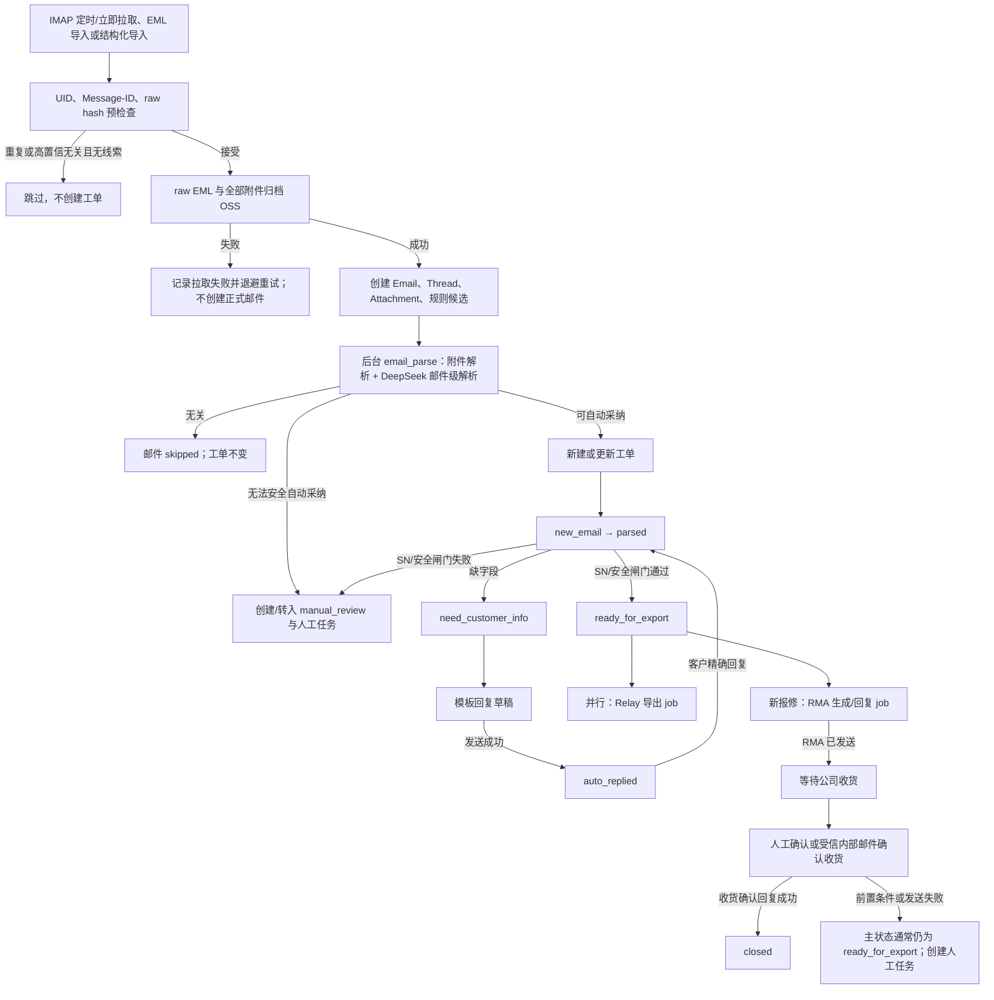
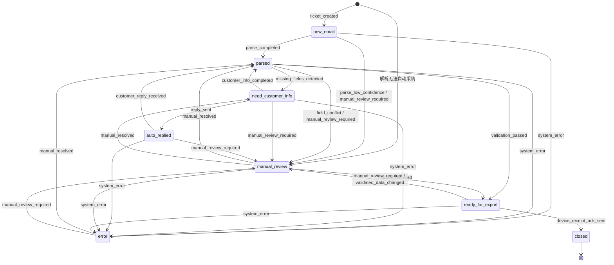

# 邮件报修系统完整业务流程与工单状态流转

> 基线日期：2026-07-27  
> 分析口径：当前工作树代码、Alembic head `e2f6a7b8c9d0`、初始化数据及 `repair_system_test` 实际数据库。  
> 事实优先级：服务代码与测试 > ORM/Alembic/种子 > 前端 > 其他文档。

## 1. 文档目的与结论

本文专门回答两个问题：

1. 不同业务情况下，邮件从进入系统到工单关闭的真实完整处理链路是什么；
2. 每个环节会不会改变工单主状态，改变到什么状态，由哪段代码触发。

当前代码的核心结论如下：

- 工单主状态实际只有 8 个：`new_email`、`parsed`、`need_customer_info`、`auto_replied`、`manual_review`、`ready_for_export`、`error`、`closed`。
- 当前不存在 `exported` 主状态。SQL Server 导出结果记录在 `relay_export_status`，RMA 结果记录在 `rma_status`，收货确认记录在 `device_receipt_ack_status`。
- `ready_for_export` 的真实含义是“SN 和外发数据通过安全闸门”，不是“已经导出”，也不是“RMA 已发送”。
- `closed` 的正常业务入口只有“公司确认收到设备，并成功回复收货确认邮件”；RMA 发送成功本身不会关闭工单。
- 所有系统外发邮件均要求找到原线程中的入站父邮件、使用模板库、写入 `In-Reply-To`/`References`，并在 SMTP 前归档完整外发 EML。
- 主状态不能单独说明整个业务进度。判断真实进度必须同时查看工单主状态、邮件解析状态、回复状态、RMA 状态、Relay 状态、收货确认状态、人工任务状态和后台任务状态。
- 代码种子定义 26 条主状态迁移规则；当前测试库仍保留 6 条旧 `manual_close` 规则。种子初始化只新增或更新规则，不会清理历史规则，因此全新数据库和当前测试库的可用迁移存在差异。

## 2. 状态体系：主状态与子状态必须分开理解

### 2.1 工单主状态

工单主状态保存在 `repair_tickets.current_status_code`，定义在：

- `backend/app/seed.py::WORKFLOW_STATUSES`
- `backend/app/models/workflow.py::WorkflowStatus`
- `backend/app/models/tickets.py::RepairTicket`

状态变化原则上通过 `backend/app/services/workflow.py::transition_ticket()`：

1. 锁定并读取当前状态；
2. 拒绝从 `closed` 继续流转；
3. 校验目标状态已启用；
4. 校验数据库中存在完全匹配的 `(from, to, trigger_event)`；
5. 更新 `current_status_code` 并增加 `ticket.version`；
6. 写入 `ticket_status_logs`；
7. 写入 `operation_logs`；
8. 进入 `manual_review` 时创建或复用人工任务。

例外：`backend/app/services/tickets.py::_invalidate_export_snapshot()` 在已验证数据被编辑时直接执行 `ready_for_export → manual_review`，自行写状态日志和人工任务，没有调用统一迁移校验。

### 2.2 业务子状态

| 维度 | 字段或表 | 典型值 | 是否直接改变工单主状态 |
| --- | --- | --- | --- |
| 邮件解析 | `emails.parse_status` | `pending`、`parsing`、`parsed`、`skipped`、`needs_manual` | 间接，解析应用后才可能改变 |
| 解析结果 | `parse_results.apply_status` | `candidate_only`、`auto_applied`、`needs_manual_review`、`partially_applied`、`rejected` | 间接 |
| SN 校验 | `repair_tickets.sn_validation_status` | `not_started`、`running`、`passed`、`failed`、`stale` | 失败通常转人工，成功不一定进入可导出 |
| 回复审核 | `reply_records.review_status` | `pending`、`auto_approved`、`approved`、`rejected` | 通常不改变 |
| 回复发送 | `reply_records.send_status` | `pending_review`、`approved_pending_send`、`sending`、`sent`、`send_failed`、`send_uncertain` | 追问成功和收货确认成功会改变 |
| RMA | `repair_tickets.rma_status` | `not_required`、`pending`、`generating`、`sending`、`sent`、`manual_review` | 不直接改变主状态 |
| Relay 导出 | `repair_tickets.relay_export_status` | `not_required`、`pending`、`running`、`succeeded`、`failed` | 不直接改变主状态 |
| 收货回复 | `repair_tickets.device_receipt_ack_status` | `not_received`、`pending_prerequisite`、`pending_review`、`sending`、`sent`、发送失败状态 | 只有确认回复发送成功才关闭 |
| 人工任务 | `manual_review_tasks.status` | `pending`、`assigned`、`claimed`、`assignment_failed`、`resolved`、`closed` | 人工解决动作可能改变 |
| 后台任务 | `job_run_logs.status` | `queued`、`running`、`retry_wait`、`success`、`failed`、`needs_manual_review`、`superseded` | 由具体 handler 决定 |

因此，`ready_for_export + rma_status=pending + relay_export_status=failed` 和
`ready_for_export + rma_status=sent + relay_export_status=succeeded` 是两个业务进度完全不同的工单，但主状态相同。

## 3. 系统总链路



## 4. 邮件进入系统

### 4.1 入口

当前入口包括：

- APScheduler 周期创建 `imap_fetch` job；
- 邮件中心手工触发 IMAP 拉取；
- EML 文件导入；
- 结构化邮件导入；
- 邮件详情页重新解析。

IMAP 主链路位于：

- `backend/app/main.py::_scheduled_imap_fetch()`
- `backend/app/services/jobs.py::_execute_job_command()`
- `backend/app/services/imap_fetcher.py::run_imap_fetch_locked()`
- `backend/app/services/imap_fetcher.py::fetch_imap_emails()`

### 4.2 IMAP 获取与去重

1. IMAP 使用只读 `SELECT`，不会修改邮箱未读状态。
2. 先查询 UID，再用 `(mailbox_account, folder_name, uid_validity, imap_uid)` 排除已处理或未到重试时间的邮件。
3. 排除后再应用批次 `limit`，避免旧 UID 长期挤占批次。
4. 下载 raw EML，解析头、正文和附件。
5. 基于以下证据去重：
   - IMAP UID 组合；
   - 标准化后的 `Message-ID`；
   - raw EML SHA-256。
6. 单封失败会回滚该封数据库事务，写入 `mail_fetch_records`，按退避时间重试，最大次数由 `IMAP_MAX_RETRIES` 控制。

此阶段不会创建工单主状态。

### 4.3 入库前无关邮件

`backend/app/services/mail_precheck.py::precheck_email_payload()` 只有在以下条件同时满足时才在 OSS 归档前跳过：

- 规则意图为 `irrelevant`；
- 置信度达到 `MAIL_PRECHECK_IRRELEVANT_MIN_CONFIDENCE`；
- 没有有效附件；
- 没有规则抽取出的业务明细；
- 没有 `In-Reply-To`；
- 没有 `References`。

结果为 `irrelevant_skipped`，只留下拉取记录，不创建正式 `emails` 行，不创建工单。

带回复头、附件或业务证据的疑似无关邮件仍会正式归档和解析，避免误丢业务邮件。

### 4.4 OSS 强制归档

正式邮件入库前必须成功归档：

- 原始 `.eml`；
- 所有未被判定为装饰性内嵌图片的附件。

`backend/app/services/emails.py::ingest_email()` 会拒绝缺少 raw EML OSS 对象或附件 OSS 对象的请求，返回 `OSS_ARCHIVAL_REQUIRED`。因此 OSS 失败不会产生半完整正式邮件和工单。

### 4.5 线程归并

`backend/app/services/emails.py::_find_thread_for_email()` 只接受精确邮件头关系：

1. 按 `References` 从后向前查找已入库父邮件；
2. 找不到时再查 `In-Reply-To`；
3. 只复用父邮件所属且未绑定已关闭工单的活动线程；
4. 没有精确关系时创建新线程，不按相似主题或发件域自动合并。

如果父邮件属于 `closed` 工单，会强制创建新线程，避免新需求污染历史关闭工单。

## 5. 邮件识别与解析分支

### 5.1 规则候选

`backend/app/services/parser.py::classify_email()` 先产生规则意图：

| 条件 | 规则意图 |
| --- | --- |
| 正文出现设备已收到语义 | `device_received` |
| 系统外发且包含 RMA | `rma_sent` |
| 有回复头且包含 SN、故障、地址等补充词 | `customer_supplement` |
| 有回复头但无明显补充词 | `normal_reply` |
| 命中退订、广告等 | `irrelevant` |
| 疑似转发主题 | `normal_reply`，低置信 |
| 命中报修、维修、故障、RMA、SN | `new_repair` |
| 其他 | `unknown` |

规则同时抽取 SN、联系邮箱、故障描述等候选，但该结果默认保存为
`parse_results.apply_status=candidate_only`，不会仅凭规则候选直接成为最终事实。

### 5.2 附件解析

`backend/app/services/emails.py::reparse_email()` 逐个调用
`backend/app/services/attachment_parser.py::parse_attachment()`：

- `docx/xlsx/csv/txt/html/prc`：本地提取文本或结构后，可交给 Qwen 生成附件级结构化结果；
- 图片和 PDF：可通过 Qwen VL 处理；
- 装饰性内嵌图片：`skipped_decorative`；
- 超过 `ATTACHMENT_MAX_AUTO_PARSE_BYTES`：`needs_manual_review`；
- 文件名、MIME 和 magic 不一致：`needs_manual_review`；
- 不支持类型：`unsupported`；
- 损坏、加密或解析异常：`needs_manual_review`。

ZIP 只作为 DOCX/XLSX/PDF 等格式内部结构的安全校验工具。普通 ZIP、RAR、7Z
不在 `SUPPORTED_ATTACHMENT_TYPES` 中，不能形成自动解压业务链路，会转人工。

附件出现 `needs_manual_review`、`unsupported` 或 `failed` 时，通常阻止自动采纳；
PRC 是例外：如果邮件级解析已经补齐必填字段，PRC 附件失败不单独阻断。

### 5.3 DeepSeek 邮件级解析

`backend/app/services/ai.py::create_ai_parse_candidate()` 将以下内容合并交给 DeepSeek：

- 邮件主题和最新回复段；
- 规则候选；
- 附件本地抽取结果；
- Qwen 多模态结果；
- 当前线程/工单上下文。

返回邮件意图、工单字段、设备明细、缺失项、冲突项、整体置信度、字段置信度和证据。

### 5.4 自动采纳与转人工

`backend/app/services/emails.py::_parse_requires_manual()` 在以下任一条件成立时要求人工：

- 没有有效 AI 解析结果；
- 意图为空或 `unknown`；
- 置信度低于 `AUTO_APPLY_MIN_CONFIDENCE`；
- 存在字段冲突；
- 存在阻断型附件异常。

结果：

- 有关联工单：把工单转为 `manual_review`；
- 无关联工单：直接创建初始状态为 `manual_review` 的工单；
- 创建或复用人工任务；
- 邮件状态变为 `needs_manual`；
- 解析结果状态变为 `needs_manual_review`。

## 6. 场景一：完整的新报修自动链路

### 6.1 触发条件

- AI 意图为 `new_repair`；
- 置信度达到自动采纳阈值；
- 无字段冲突和阻断型附件异常；
- 能提取或补齐必填字段和设备明细；
- SN 和完整安全闸门通过。

### 6.2 数据与状态变化

1. `apply_parse_result()` 查找线程关联工单。
2. 找不到活动工单时创建：
   - `repair_tickets`；
   - `repair_ticket_items`；
   - `email_ticket_links`；
   - 初始 `ticket_status_logs: null → new_email / ticket_created`；
   - 将 `email_threads.ticket_id` 指向新工单。
3. 采纳字段与明细，写 `field_audit_logs`。
4. `new_email → parsed / parse_completed`。
5. 执行 `validate_and_mark_ready_for_export()`：
   - SN 本地或 Relay 校验；
   - 补齐唯一客户/物料数据；
   - 校验联系人、邮箱、地址、故障、明细、数量和来源邮件；
   - 保存 SN hash 和安全快照 hash。
6. `parsed → ready_for_export / validation_passed`。
7. 按配置并行创建：
   - `relay_ticket_export` job；
   - `rma_authorization` job。

主状态路径：

```text
null → new_email → parsed → ready_for_export
```

注意：`new_email` 通常在同一解析事务中很快变为 `parsed`，是可审计的瞬态状态，
不一定能在页面轮询时看到。

## 7. 场景二：缺少客户信息与多轮追问

### 7.1 首轮缺字段

自动采纳后，`required_missing_for_ticket()` 重新按工单和设备明细计算缺失字段：

```text
null → new_email → parsed → need_customer_info
```

触发迁移：

```text
parsed → need_customer_info / missing_fields_detected
```

随后 `_try_create_reply_draft()` 仅在工单确实为 `need_customer_info` 时生成
`missing_fields` 模板回复。

### 7.2 回复草稿与发送

草稿必须：

- 选择启用的业务模板；
- 国内邮件再套用 `domestic_company_base`；
- 绑定同线程入站父邮件；
- 主题保持原线程 `Re:`；
- 写入父邮件 `Message-ID` 到 `In-Reply-To` 和 `References`；
- 正文不能在审核接口中脱离模板修改。

若 `AUTO_FOLLOWUP_ENABLED=false`，草稿停在：

```text
review_status=pending
send_status=pending_review
工单仍为 need_customer_info
```

若允许自动发送，或人工审核后发送成功：

```text
need_customer_info → auto_replied / reply_sent
followup_count += 1
```

SMTP 失败或发送结果不确定时不会增加追问次数，也不会进入 `auto_replied`。

### 7.3 客户回复补充

客户回复带精确 `In-Reply-To/References`，归入原活动线程，AI 意图通常为
`customer_supplement`：

1. 关联原工单；
2. 追加或修正字段、设备明细和证据；
3. 从实际已发送追问数重新计算 `followup_count`；
4. `auto_replied → parsed / customer_reply_received`；
5. 若仍缺字段，再 `parsed → need_customer_info`；
6. 若补齐字段，重新执行 SN 和安全闸门；
7. 通过后进入 `ready_for_export`。

完整路径：

```text
parsed
  → need_customer_info
  → auto_replied
  → parsed
  → need_customer_info   （仍缺字段，可继续追问）
  → auto_replied
  → parsed
  → ready_for_export     （补齐并通过校验）
```

### 7.4 追问上限

`followup_count >= max_followup_count` 时：

```text
need_customer_info → manual_review / manual_review_required
```

并创建 `followup_limit` 高优先级人工任务。

当前缺口：虽然存在 `auto_followup` job handler 和间隔配置，但没有周期扫描并入队
第二轮或后续催补的生产路径。当前自动化只覆盖解析事件触发的首轮追问，以及人工任务
触发的追问。

## 8. 场景三：低置信、冲突、附件异常或 AI 不可用

### 8.1 新邮件首次解析即不安全

如果能先创建正常工单，再发现解析低置信：

```text
new_email → manual_review / parse_low_confidence
```

如果 AI 无结果、意图未知、附件异常或冲突在自动采纳前已确认，
`ensure_manual_review_ticket_from_parse_result()` 会直接创建：

```text
null → manual_review / manual_review_required
```

这类工单不会经历 `new_email` 和 `parsed`。

### 8.2 已有工单后发现问题

任意未关闭状态可通过 `manual_review_required` 转人工。常见人工任务类型包括：

- `ai_review_required`
- `ai_unavailable`
- `field_conflict`
- `sn_validation_failed`
- `sn_validation_required`
- `export_safety_failed`
- `reply_parent_required`
- `reply_template_missing`
- `reply_send_failed`
- `reply_send_uncertain`
- `rma_generation_failed`
- `device_received_prerequisite`

进入 `manual_review` 时，系统按工单和任务类型复用尚未关闭的任务，防止同类任务重复创建。

## 9. 场景四：SN 校验与完整安全闸门

### 9.1 SN 单独校验

`POST /tickets/{id}/validate-sn` 调用
`backend/app/services/ticket_safety.py::validate_ticket_sn_core()`：

- 锁工单；
- 对 SN 标准化为大写；
- 本地查询 `sn_assets`；
- 可选查询 SQL Server Relay；
- 校验存在性、客户归属、物料信息和冲突；
- 保存输入快照 hash、结果和校验时间。

SN 校验通过只设置 `sn_validation_status=passed`，不会直接进入
`ready_for_export`。

### 9.2 校验失败

失败时：

- `sn_validation_status=failed`；
- 当前不是 `manual_review/closed` 时转为 `manual_review`；
- 已在 `manual_review` 时只创建或复用 `sn_validation_failed` 任务；
- `closed` 不改变。

### 9.3 完整安全闸门

`POST /tickets/{id}/validate-export` 或自动解析链路调用
`validate_and_mark_ready_for_export()`。除 SN 外还检查：

- 必填客户字段；
- 联系邮箱格式以及是否与原客户来信地址一致；
- 至少一条、最多 300 条设备明细；
- 每条物料代码、物料名称、SN、故障描述；
- 一条 SN 的数量必须为 1；
- 控制字符和字段长度；
- 原始客户入站邮件是否可追溯；
- 新报修 RMA 的 1～300 条明细限制。

通过：

```text
parsed → ready_for_export / validation_passed
manual_review → ready_for_export / manual_resolved
```

人工任务进入可导出时，必须排除当前正在解决的任务后确认没有其他开放任务。

失败：

```text
当前非 manual_review → manual_review / manual_review_required
当前已为 manual_review → 主状态不变，新增/复用 export_safety_failed 任务
```

### 9.4 已验证数据再次修改

编辑工单字段或设备明细会清空 SN/安全快照并将相关子状态重置。
如果工单原为 `ready_for_export`：

```text
ready_for_export → manual_review / validated_data_changed
```

这是当前唯一绕过 `transition_ticket()`、直接设置主状态的业务入口。

## 10. 场景五：普通回复、孤立回复和已关闭线程

### 10.1 活动线程中的普通回复

`normal_reply` 关联活动线程后会记录解析结果和邮件关系。只有工单原为
`auto_replied` 时，当前代码明确执行：

```text
auto_replied → parsed / customer_reply_received
```

如果普通回复没有被分类为 `customer_supplement`，后续不会自动执行完整安全闸门，
工单可能停在 `parsed`，需要人工判断其是否包含实际业务补充。

### 10.2 无精确回复头的补充、普通回复、RMA 状态邮件或收货通知

当不存在可精确关联的活动工单时，以下意图不会猜测关联旧工单：

- `customer_supplement`
- `normal_reply`
- `rma_sent`
- `device_received`

系统创建独立 `manual_review` 工单和对应 orphan 任务，不修改任何既有工单。

### 10.3 已关闭工单的原邮件链收到新邮件

线程解析发现父邮件属于 `closed` 工单时，会创建新线程：

- 新邮件被识别为 `new_repair`：可创建全新工单并走新报修流程；
- 被识别为回复或补充：因新线程没有活动工单，创建独立人工复核工单；
- 原 `closed` 工单不会重新打开。

这实现了“关闭后同一邮件链出现新需求，不污染旧工单”，但回复型新邮件通常需要人工
确认是否真的是新报修。

## 11. 场景六：RMA 生成与发送

### 11.1 触发

只有来源客户邮件意图为 `new_repair` 的工单，在通过完整安全闸门后设置：

```text
current_status_code=ready_for_export
rma_required=true
rma_status=pending
```

并创建幂等 `rma_authorization` job。job 的幂等和过期判断绑定：

- 工单 ID；
- 工单 version；
- 安全快照 hash；
- SN 校验 hash；
- RMA 模板版本。

### 11.2 正常自动发送

`RMA_AUTO_SEND_ENABLED=true` 时：

1. 根据国内/海外、质保和客户规则选择模板；
2. 找到原线程入站父邮件；
3. 生成 RMA PDF；
4. 将 PDF 上传 OSS；
5. 创建带模板、父邮件回复头和 PDF 引用的 `ReplyRecord`；
6. `AUTO_SEND_ENABLED=true` 时直接发送，否则等待人工审核；
7. SMTP 成功后 `rma_status=sent`。

主状态始终保持：

```text
ready_for_export
```

RMA 发送成功不会产生 `exported`，也不会关闭工单。

### 11.3 RMA 自动附件关闭

`RMA_AUTO_SEND_ENABLED=false` 时，不生成或附加 RMA PDF，而是使用
`rma_attachment_disabled_receipt` 模板发送新报修回执：

- 回执发送成功；
- `rma_status` 仍为 `manual_review`；
- 创建 `rma_attachment_disabled` 人工任务；
- 主状态仍为 `ready_for_export`。

### 11.4 转人工条件

以下条件将 `rma_status` 设为 `manual_review` 并创建人工任务，但通常不把主状态
从 `ready_for_export` 改成 `manual_review`：

- 工单状态或快照不符合要求；
- 找不到原线程父邮件；
- 模板缺失或禁用；
- 国内基础模板缺失；
- 特殊客户规则要求人工；
- 质保或价格规则无法自动决定；
- PDF 模板、字体、生成或 OSS 上传失败；
- 自动发送关闭；
- SMTP 失败或结果不确定。

这是有意设计：RMA/回复失败不破坏已经通过的安全快照，靠人工任务表达待处理事项。

## 12. 场景七：Relay 导出和 `export_sap`

### 12.1 SQL Server Relay

启用 Relay 后，进入 `ready_for_export` 会创建不可变版本快照：

```text
relay_export_status: pending → running → succeeded
                                  └→ failed
```

如果工单 version 或安全 hash 已变化，旧 job 变成 `superseded`，不会写出过期数据。

无论成功、失败还是 superseded，工单主状态仍为 `ready_for_export` 或后续业务状态，
不会进入 `exported`。

### 12.2 `export_sap`

当前 `export_sap` 已有 ORM、迁移和数据库表，但业务服务中没有创建、更新或推送该表数据
的调用链。它目前是结构就绪的 SAP 中转表，不代表 SAP 导出流程已经实现。

## 13. 场景八：设备到货确认与关闭

### 13.1 触发入口

设备到货的含义是“公司收到客户寄来的待修设备”，入口有：

- 人工调用 `POST /tickets/{id}/confirm-device-received`；
- 受信内部邮箱发送带精确线程头的收货通知，经 AI 识别为 `device_received`。

自动邮件确认还要求：

- 发件人在 `DEVICE_RECEIPT_TRUSTED_SENDERS`；
- 存在 `In-Reply-To` 或 `References`；
- AI 置信度达到自动采纳阈值。

不满足时不自动关闭，创建 `device_received_untrusted` 人工任务。

### 13.2 前置条件不足

系统会先幂等记录 `device_received_at/source/email/note/idempotency_key`。

如果：

- 主状态不是 `ready_for_export`；或
- `rma_status != sent`；

则：

```text
device_receipt_ack_status=pending_prerequisite
主状态不变
```

并创建 `device_received_prerequisite` 人工任务。

如果设备先到、RMA 后发送，RMA 发送成功后会再次调用收货确认逻辑，继续生成确认回复。

### 13.3 正常关闭

前置条件满足后：

1. 找原线程入站父邮件；
2. 选择 `device_received_ack` 模板；
3. 国内套公司基础模板；
4. 创建原链回复草稿；
5. 自动发送或等待人工审核；
6. SMTP 确认成功；
7. 更新 `device_receipt_ack_status=sent`；
8. 执行：

```text
ready_for_export → closed / device_receipt_ack_sent
```

这是当前代码中唯一完整、稳定且与种子一致的正常关闭路径。

### 13.4 发送失败或不确定

- `device_receipt_ack_status=send_failed` 或 `send_uncertain`；
- 创建回复发送人工任务；
- 主状态保持 `ready_for_export`；
- 人工通过 `reconcile-send` 确认“实际已发送”后，才补记发送成功并关闭工单。

## 14. 人工复核完整链路

### 14.1 创建与负责人

进入 `manual_review` 或出现局部业务失败时调用
`create_manual_task_if_missing()`：

- 同一工单、同一任务类型、开放状态下复用任务；
- 优先沿用工单负责人；
- 否则由路由逻辑选择可用 operator；
- 找不到可用负责人时创建管理员高优先级通知；
- 创建用户通知和操作日志。

正常 API 已禁用领取、人工分配和释放，返回 HTTP 410。系统负责人或管理员更正工单负责人
是当前分配方式。

### 14.2 人工可执行动作

`backend/app/services/manual_review.py::resolve_task()` 支持：

| `next_action` | 业务行为 | 主状态变化 |
| --- | --- | --- |
| `transition_ready_for_export` | 重跑 SN 和安全闸门 | `manual_review → ready_for_export`，失败则不解决任务 |
| `wait_customer_info` | 等待客户补充 | `manual_review → need_customer_info` |
| `generate_followup` | 先转等待客户，再按模板生成追问 | `manual_review → need_customer_info`，发送成功后再到 `auto_replied` |
| `reparse` | 重新解析任务关联邮件 | 取决于解析结果；如果仍为人工且无替代开放任务，原任务恢复 pending |
| `keep_manual_review` | 记录处理意见但保持开放 | 不变 |
| `close_ticket` | 尝试 `manual_close` | 新库规则不支持；当前测试库因残留旧规则可能成功 |

### 14.3 离开人工状态的阻塞校验

`transition_ticket()` 在 `manual_review` 离开时会检查其他开放任务。除正在解决的任务外，
只要还存在 `pending/claimed/assigned/assignment_failed` 任务，就拒绝流转并返回
`MANUAL_TASKS_UNRESOLVED`。

## 15. 回复发送的统一安全链路

普通回执、追问、RMA 回复和收货确认共用以下规则：

1. 必须有启用的业务模板；
2. 中文必须有启用的国内公司基础模板；
3. 必须绑定同工单、同活动线程的入站父邮件；
4. `In-Reply-To` 必须等于父邮件 Message-ID；
5. `References` 必须包含父邮件 Message-ID；
6. 主题必须是父邮件原主题的 `Re:` 形式；
7. 最终正文不能脱离模板正文；
8. 收件人和发件登录必须通过 SMTP 安全校验；
9. 在网络发送前先把完整外发 RFC822 EML 上传 OSS；
10. SMTP 成功后创建 outbound `emails` 行并关联线程；
11. SMTP 不确定时不自动重试，进入人工对账，避免重复发信。

当前生产限制：`ReplyRecord.to_addresses` 仍写固定测试收件邮箱，底层信封也要求固定测试
发件/收件账号，因此真实客户外发尚未开放。

## 16. 工单状态定义表

| 状态 | 含义 | 典型进入条件 | 可执行核心动作 | 主要出边 |
| --- | --- | --- | --- | --- |
| `new_email` | 已创建工单、解析结果尚未完成状态判断 | 新报修自动创建 | 应用解析结果 | `parsed`、`manual_review`、`error` |
| `parsed` | 当前解析结果已采纳，等待缺失判断或安全校验 | 解析完成；客户补充后恢复；人工/异常恢复 | 缺失判断、SN 校验、安全闸门 | `need_customer_info`、`ready_for_export`、`manual_review`、`error` |
| `need_customer_info` | 缺少必填数据，等待追问或客户补充 | 解析后缺字段；人工决定等待客户 | 生成模板追问、采纳客户补充 | `auto_replied`、`parsed`、`manual_review`、`error` |
| `auto_replied` | 追问已确认发送，等待客户回复 | 追问 SMTP 成功或人工确认实际已发送 | 接收并解析客户回复 | `parsed`、`manual_review`、`error` |
| `manual_review` | 存在需要人工处理的全局问题 | 低置信、冲突、SN/安全失败、业务异常 | 修改、重解析、追问、重跑安全闸门 | `parsed`、`need_customer_info`、`ready_for_export`、`error`；代码种子另有实际不可达的 `auto_replied` |
| `ready_for_export` | SN 和完整外发数据已验证 | 自动或人工安全闸门通过 | Relay、RMA、收货确认 | `closed`、`manual_review`、`error` |
| `error` | 人工显式标记的系统异常状态 | 通用状态 API 的 `system_error` | 人工排查和通用迁移恢复 | `parsed`、`manual_review`；当前测试库还残留 `closed` |
| `closed` | 当前工单业务终止 | 收货确认回复成功 | 只读和历史追踪 | 无 |

## 17. 代码种子定义的完整迁移规则

下表是 `WORKFLOW_TRANSITIONS` 当前构造出的 26 条规则。

| 起点 | 终点 | 触发事件 | 真实调用或可达性 |
| --- | --- | --- | --- |
| `new_email` | `parsed` | `parse_completed` | 自动采纳 |
| `new_email` | `manual_review` | `parse_low_confidence` | 自动 |
| `parsed` | `ready_for_export` | `validation_passed` | 自动/人工安全闸门 |
| `parsed` | `need_customer_info` | `missing_fields_detected` | 自动 |
| `parsed` | `manual_review` | `field_conflict` | 规则存在，当前主要由通用迁移或旧调用使用 |
| `need_customer_info` | `auto_replied` | `reply_sent` | 追问成功 |
| `need_customer_info` | `parsed` | `customer_info_completed` | 客户补齐后自动 |
| `manual_review` | `auto_replied` | `reply_sent` | 规则存在，但当前回复服务要求追问前必须先转 `need_customer_info`，正常不可达 |
| `auto_replied` | `parsed` | `customer_reply_received` | 客户回复自动 |
| `manual_review` | `ready_for_export` | `manual_resolved` | 人工安全闸门通过 |
| `manual_review` | `parsed` | `manual_resolved` | 可通过通用迁移 API；人工任务动作没有直接选项 |
| `manual_review` | `need_customer_info` | `manual_resolved` | 人工任务 |
| `error` | `parsed` | `manual_resolved` | 通用迁移 API；人工任务动作没有直接选项 |
| `ready_for_export` | `closed` | `device_receipt_ack_sent` | 收货确认回复成功 |
| `new_email` | `manual_review` | `manual_review_required` | 通用人工兜底 |
| `parsed` | `manual_review` | `manual_review_required` | 通用人工兜底 |
| `need_customer_info` | `manual_review` | `manual_review_required` | 追问上限、发送等异常 |
| `auto_replied` | `manual_review` | `manual_review_required` | 通用人工兜底 |
| `ready_for_export` | `manual_review` | `manual_review_required` | 规则存在；局部发送失败通常只建任务，不破坏 ready 状态 |
| `error` | `manual_review` | `manual_review_required` | 通用迁移 |
| `new_email` | `error` | `system_error` | 仅通用迁移 API/前端操作 |
| `parsed` | `error` | `system_error` | 仅通用迁移 API/前端操作 |
| `need_customer_info` | `error` | `system_error` | 仅通用迁移 API/前端操作 |
| `auto_replied` | `error` | `system_error` | 仅通用迁移 API/前端操作 |
| `manual_review` | `error` | `system_error` | 仅通用迁移 API/前端操作 |
| `ready_for_export` | `error` | `system_error` | 仅通用迁移 API/前端操作 |

`closed` 无任何出边。

## 18. 状态流转图



图中没有画 `manual_review → auto_replied / reply_sent`，因为虽然种子有规则，但当前回复
服务正常路径不可达。

## 19. 当前数据库与代码状态机差异

2026-07-27 对 `repair_system_test` 的只读核验结果：

- 8 个主状态全部启用；
- 代码种子构造 26 条迁移；
- 数据库有 32 条启用迁移；
- 多出的 6 条均为历史 `manual_close`：
  - `new_email → closed`
  - `parsed → closed`
  - `need_customer_info → closed`
  - `auto_replied → closed`
  - `manual_review → closed`
  - `error → closed`

原因是 `_seed_workflow()` 对已有规则执行 upsert，但不会禁用或删除不再存在于代码常量中的
旧规则。

影响：

- 全新数据库：`manual_review.py` 的 `close_ticket` 会报
  `WORKFLOW_TRANSITION_NOT_ALLOWED`；
- 当前测试库：同一动作可能成功；
- 前端工单页仍展示 `manual_close` 操作，因此不同环境行为不一致；
- “只有收货确认回复成功才关闭”的业务规则可被残留数据库规则绕过。

## 20. 无法到达、容易停滞或语义不一致的状态

### 20.1 `exported` 不存在

文档或历史需求中的 `exported` 没有状态定义、迁移或前端枚举。导出成功只体现在
`relay_export_status=succeeded`。

### 20.2 `manual_review → auto_replied` 正常不可达

种子允许该迁移，但 `create_reply_draft()` 明确要求追问类型只能在
`need_customer_info` 创建。人工流程会先转 `need_customer_info`，再生成和发送追问。

### 20.3 `error` 不是自动异常汇聚状态

虽然每个非终态都有 `system_error → error` 规则，但业务异常处理代码主要创建人工任务或
进入 `manual_review`。当前没有统一异常处理器自动把工单转为 `error`。
`error` 主要通过工单页“标记异常”或通用迁移 API 进入。

### 20.4 `ready_for_export` 可能长期停留

以下情况主状态都保持 `ready_for_export`：

- Relay 导出失败；
- RMA 生成失败；
- RMA 待人工审核；
- SMTP 失败或结果不确定；
- RMA 已发送但设备尚未收到；
- 设备已收到但收货确认回复未发送成功。

这不是非法状态，但必须结合子状态和开放人工任务判断是否真正完成。

### 20.5 普通回复可能停在 `parsed`

`auto_replied` 工单收到高置信 `normal_reply` 后会回到 `parsed`，但只有
`new_repair/customer_supplement` 会继续自动安全校验。没有明显补充关键词的真实客户回复
可能停在 `parsed`。

### 20.6 解析应用无条件增加 version

`apply_parse_result()` 即使普通回复没有修改业务字段也增加 `ticket.version`。
如果工单已有等待执行的 Relay/RMA job，旧 job 可能因为 version 不一致变为
`superseded`，而普通回复路径又不会重新创建安全快照和新 job。

## 21. 异常恢复路径

| 异常 | 记录 | 主状态 | 恢复方式 |
| --- | --- | --- | --- |
| IMAP 单封失败 | `mail_fetch_records.retry_wait/failed` | 尚无工单 | 到期退避重试，耗尽后人工排查 |
| OSS 入站归档失败 | OSS 对象元数据、拉取错误 | 尚无工单 | 幂等重试归档 |
| AI 不可用/低置信 | AI 日志、ParseResult、人工任务 | `manual_review` | 人工修正、重解析或部分采纳 |
| 附件异常 | Attachment parse_status/error、人工任务 | `manual_review` | 下载原件人工核对后采纳 |
| SN/安全闸门失败 | SN 结果、快照、人工任务 | `manual_review` | 修正字段/明细，重新校验 |
| 模板或父邮件缺失 | Reply error、人工任务 | 原状态或 `manual_review` | 补模板/修复关联后重新生成 |
| SMTP 明确失败 | `send_failed`、人工任务 | ready 工单通常不变；其他状态可转人工 | 修复配置后人工重发 |
| SMTP 结果不确定 | `send_uncertain`、人工任务 | 不自动推进 | 人工查邮箱后 `reconcile-send` |
| Relay 失败 | export/job error、`relay_export_status=failed` | `ready_for_export` | job 按可重试错误退避，或人工修复 |
| RMA 快照过期 | job `superseded` | 当前状态 | 重新安全校验生成新 version job |
| RMA 生成失败 | `rma_status=manual_review`、任务 | `ready_for_export` | 修复模板/字体/OSS 后人工处理 |
| 收货前置不足 | `pending_prerequisite`、任务 | 原状态 | RMA 发送后自动续跑或人工重试 |

## 22. 关键代码位置索引

| 能力 | 文件与函数 |
| --- | --- |
| 状态和迁移种子 | `backend/app/seed.py::WORKFLOW_STATUSES/WORKFLOW_TRANSITIONS` |
| 统一状态迁移 | `backend/app/services/workflow.py::transition_ticket` |
| 人工任务创建 | `backend/app/services/workflow.py::create_manual_task_if_missing` |
| IMAP 拉取 | `backend/app/services/imap_fetcher.py::fetch_imap_emails` |
| 入库前检查 | `backend/app/services/mail_precheck.py::precheck_email_payload` |
| 邮件入库与线程 | `backend/app/services/emails.py::ingest_email/_find_thread_for_email` |
| 邮件解析总编排 | `backend/app/services/emails.py::reparse_email` |
| 规则分类 | `backend/app/services/parser.py::classify_email/analyze_email_rules` |
| 附件解析 | `backend/app/services/attachment_parser.py::parse_attachment` |
| AI 邮件候选 | `backend/app/services/ai.py::create_ai_parse_candidate` |
| 工单创建与应用 | `backend/app/services/tickets.py::create_ticket_from_parse_result/apply_parse_result` |
| SN 与安全闸门 | `backend/app/services/ticket_safety.py::validate_ticket_sn_core/validate_and_mark_ready_for_export` |
| 回复模板与发送 | `backend/app/services/replies.py::create_reply_draft/_send_reply_record` |
| RMA | `backend/app/services/replies.py::create_and_send_rma_authorization` |
| RMA PDF | `backend/app/services/rma_pdf.py::build_rma_pdf_data/render_rma_pdf` |
| Relay 导出 | `backend/app/services/relay_jobs.py::execute_ticket_relay_export` |
| 设备收货 | `backend/app/services/device_receipts.py::confirm_device_received` |
| 人工处理 | `backend/app/services/manual_review.py::resolve_task` |
| 后台任务执行 | `backend/app/services/jobs.py::execute_claimed_job` |

## 23. 流程验收判定

不能只凭主状态判断闭环。建议按以下组合验收：

### 23.1 等待客户

```text
current_status_code=auto_replied
最近追问 reply.send_status=sent
followup_count 与实际已发送追问数量一致
```

### 23.2 已通过安全闸门但仍在处理中

```text
current_status_code=ready_for_export
sn_validation_status=passed
safety_check_hash 非空
并继续检查 rma_status、relay_export_status 和开放人工任务
```

### 23.3 新报修 RMA 已完成

```text
current_status_code=ready_for_export
rma_required=true
rma_status=sent
RMA reply.send_status=sent
rma_pdf_oss_object_id 非空
```

### 23.4 完整关闭

```text
current_status_code=closed
device_received_at 非空
rma_status=sent
device_receipt_ack_status=sent
收货确认 reply.send_status=sent
存在 ready_for_export → closed / device_receipt_ack_sent 状态日志
```

### 23.5 尚不能宣称实现

- 出现 `export_sap` 数据并成功推送 SAP；
- 存在 `exported` 主状态；
- 自动定时多轮催补；
- 真实客户 SMTP 外发；
- 所有环境都严格禁止人工绕过收货闭环关闭工单。

